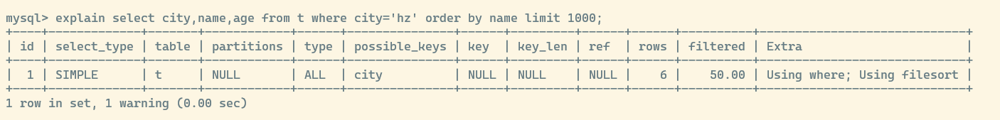
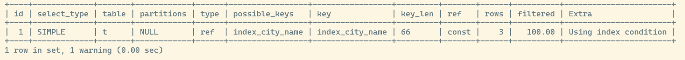
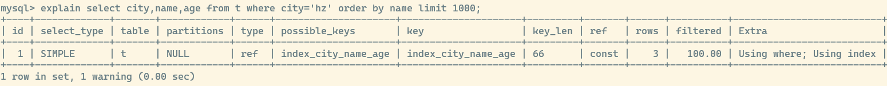

## order by 的工作原理

假设有表 `t` 包含 `id,name,city,age,addr` 等字段,现在要检索 `city = hz` 的前若干条信息,并且按照 `name` 排序

```sql
select city,name,age from t where city='hz' order by name limit 1000;
```

使用 `explain` 检查语句的执行情况



可以看到 `Extra` 字段里面 `Using filesort` 表示需要排序,而 mysql 会给每个线程分配一块内存用于排序,称为 `sort buffer`

整个排序流程如下

1. 初始化 `sort buffer`,放入 `name,city,age` 三个字段
2. 从索引 `city` 找到第一满足 `city = hz` 的主键 `id`
3. **回表** 查询聚簇索引取出整行记录,再取出 `name,city,age` 三个字段,放入 `sort buffer`
4. 从索引 `city` 开始遍历下一个记录,重复 2-3-4 步骤,直到不满足 `city = hz` 的条件
5. 在 `sort buffer` 里面,对 `name` 字段做快速排序
6. 返回 `srot buffer` 前若干行

对于排序操作,如果分配的 `sort buffer` 够大,那么可以在内存里面就完成排序; 如果数据量过大 `sort buffer` 放不下,就不得不使用磁盘临时文件辅助排序

可以看到目前的排序都是把结果集放到 `sort buffer` 里面完成的,也就是说完成排序后就可以直接从 `sort buffer` 内存返回了

还有一种情况,如果说查询的字段过多,导致 `sort buffer` 里面放不下那么多字段,那么 mysql 就需要换用另外一种排序算法 `rowid` 排序

上面的步骤 `1,2` 不变

3. **回表** 查询后不再取出完整字段,而是仅有 `id` 和排序字段 `name` 放入 `sort buffer` 
4. 直到 `city` 不满足条件后,对 `sort buffer` 进行排序
5. 遍历排序结果前若干行,取出 `id` 再次**回表** 查询得到原有的查询字段

上述两种排序方式,前者称为 **全字段排序** 也就是把所有查询字段都放到 `sort buffer` 里面; 后者称为 **rowid排序** 仅把排序字段和主键 `id` 放入 `sort buffer` 里面,在排序完成后通过 **回表** 得到查询字段

可以看到,如果内存够用, **全字段排序** 就能够在内存里面完成所有的查询和排序操作; mysql 的一个设计思想就是 **如果内存够用,就要尽可能利用内存,减少磁盘访问**

### 是否所有的 order by 都需要排序呢

上面例子的 `order by` 为何需要排序,是因为 `city` 索引和 `name` 字段是相对无序的

如果对 `city, name` 创建联合索引,这个时候从索引树里面取出第一条 `city = hz` 的记录开始往后遍历时 `name` 字段自然也就是有序的,就不在需要排序了



可以看到此时的 `Extra` 字段里面已经没有 `Using filesort` 信息了,仅仅通过索引的排序就完成 `order by` 操作

`Using index condition` 表示当前索引并没有能完全解决查询字段,还需要通过 **回表** 查询才能包含完整的查询字段; 

所以这个查询语句还可以进一步优化,在 `city,name,age` 三个字段上创建联合索引后再次查询



可以看到此时 `Extra` 字段上面只有 `Using where; Using index` 了,其中 `Using index` 表示使用了 **覆盖索引优化**,这样就减少了 **回表** 查询,进一步提升了查询速度

`using index`：使用覆盖索引的时候就会出现,**仅仅使用索引就能完成全部查询**

`using where`：在查找使用索引的情况下，需要要 **回表** 去查询所需的数据,连 **索引下推** 优化技术都没用上

`using index condition`：查找使用了索引，但是需要要 **回表** 查询数据, 包括 **索引下推** 优化后还需要 **回表** 查询 **(这个仅在 5.6 版本以后才出现,因为索引下推技术在 5.6 之后才添加的)**

`using index; using where`：查找使用了索引，但是需要的数据都在索引列中能找到，所以不需要 **回表** 查询数据