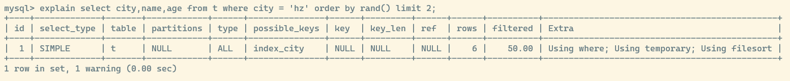

## mysql 如何取随机数

仍然用之前的 `t` 表,假如要 **随机** 获取 2 条 `city = 'hz'` 的记录,最简单的就是 `order by rand()` 排序实现

```sql
select city,name,age from t where city = 'hz' order by rand() limit 2;
```

分析执行过程如下:


可以看到 `Extra` 里面有 `Using temporary` 表示使用到临时表, `Using filesort` 表示需要排序,而且要在临时表上排序

大致的排序过程如下:

1. 创建内存临时表,从 `t` 表中取出所有 `city = 'hz'` 的记录,对于查询字段 `city,name,age` 进行 `rand()` 函数计算生成一个 0 到 1 之间的随机数 R 值放入临时表 R 列,并且把字段也放入临时表 W 列
2. 初始化 `sort buffer` 将临时表的内容放入 `sort buffer` 对随机数 R 排序,并且 `sort buffer` 还要记录每个 R 的位置信息(用于在临时表里面定位数据位置)
3. 排序完成后, `sort` 取出前 2 行记录,从临时表里面得到具体数据,并返回结果集