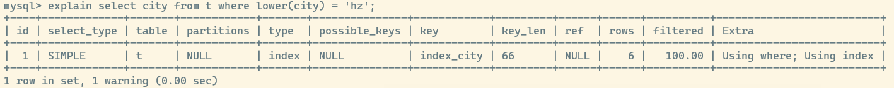
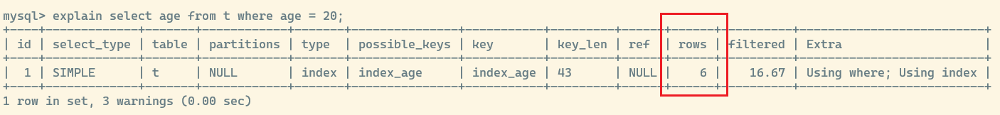
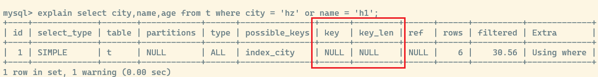

## mysql 索引失效的原因

先提前提出一个总结: **造成索引失效的根本原因就是某些操作打破了索引的有序性**

### 在查询字段上做函数计算
mysql 索引的有序性来自于 B+ 的性质: 同一层的节点之间是有序的

而对于一个明确的查询条件,`where k = 5` mysql 是可以明确的从索引树里面找到 `k = 5` 这条记录

然而对于一个函数计算,例如函数计算 `floor(k) = 5` 这个时候的函数计算就会破坏整个索引的 **有序性**,从而导致索引树上的有序遍历失效

虽然说函数计算会导致有序性被破坏,但是 mysql 在查询的时候仍然计算主键索引和其他普通索引,选择一个较小数据量的索引树来遍历所有数据



可以看到在这个查询当中,索引 `city` 上面进行了 `lower()` 函数操作,最后扫描了全表 **(一共就 6 行数据)**,但是 `Extra` 字段仍然有 `Using where; Using index`

其中 `Using index` 表明使用了 **覆盖索引** 优化技术, mysql 仍然通过索引 `index_city` 遍历了整棵树; 是因为 `index_city` 索引已经包含了要的查询字段,而主键索引需要加载更多的数据到内存里面,空间利用效率不如其他索引

### 隐式类型转换

如果有一个索引列 `index_age` 是 `varcha` 类型的

```sql
select age from t where age = 20
```

注意,这里的查询语句里面 `age = 20` 传入的是一个 **整数型**,这里的 sql 语句并不会报错,但是实际上也会导致索引失效从而全表扫描



可以看到实际上通过索引 `index_age` 扫描了全表

因为 mysql 的隐式类型转换,是 mysql 的一个语法糖,即 mysql 会悄悄地为字段添加转换函数,实际上真正的 sql 语句如下

```sql
select age from t where CAST(age as signed int) = 20;
```

这就违反了 **在索引列上做函数计算** ,打破了索引树的有序性,从而导致索引失效

### 隐式字符集转换

同上,对于 `utf8` 的字符集会转换为其超集 `utf8mb4` 这也违反了 **在索引列上做函数计算** ,打破了索引树的有序性,从而导致索引失效

### 索引列的左值计算

什么叫做左值计算,就是在等号左边进行计算,例如 `where k + 1 = 5`

我们很清楚其实就是为了找到 `k = 4` 的记录,但是 mysql 的优化器却无法识别 `k + 1 = 5` 它只能挨个遍历整棵索引树去计算 `k + 1` 的结果是不是等于 `5`

虽然左值计算不会打破索引的有序性,但是 mysql 优化器仍然无法直接得到左值计算的结果,必须要通过遍历整棵索引树依次计算后才能确定结果集

所以索引列的 **左值计算** 也会导致索引失效

### 最左匹配原则

在联合索引当中,**最左侧的字段优先匹配**,例如存在索引 `index(a,b,c)

* `a,b` 满足最左匹配原则,索引列 `a,b` 都能够用上
* `a,c` 只有索引列 `a` 能够用上
* `b,c` 索引失效,因为没有匹配到最左的索引列

不止联合索引,包括在单个索引列上的 `like` 查询,也要符合最左匹配原则,例如索引 `index(name)`

* `name like 'na%'` 满足 `name` 的最左前缀,能够使用索引
* `name like '%na%'` 不满足最左前缀,索引失效

### 错误的使用了 or 关键字

例如之前的 `t` 表,有 `city` 索引,如下查询明显走了全表扫描



虽然 `city` 上有索引,但是 `name` 字段没有索引会导致全表扫描; 既然已经有全表扫描了,那么就不在需要再从 `city` 索引树上查找 `city = 'hz'` 的记录了,所以 mysql 放弃了索引使用全表扫描

要想 `or` 关键字用到索引,最好是在 `or` 两侧的字段都建立索引

还需要注意的是 `or` 两侧如果有 `<` 或者 `>` 范围查询,也会导致索引失效

### 不等于会导致索引失效

对索引字段做 `!=` 或者 `<>` 或者 `is not NULL` 操作会导致索引失效

需要注意的是,如果在主键索引上做 `!=` 不等于计算,是会正常走索引的,估计是 mysql 在主键索引上有特殊的优化规则

### 范围查找

常见的范围查找 `in,exists,not in,not exists,between and` 等等

其中 `not in` 和 `not exists` 会导致索引失效

同上,在主键索引上做 `not in` 或者 `not exists` 也会正常走索引