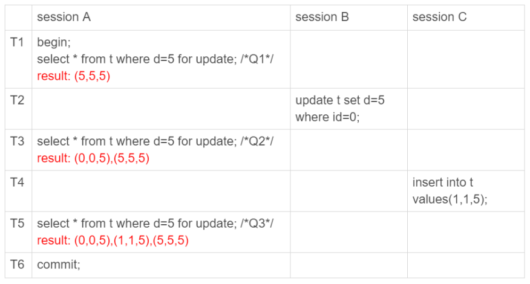
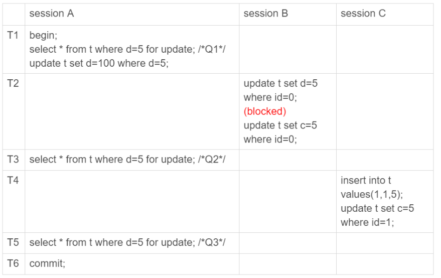
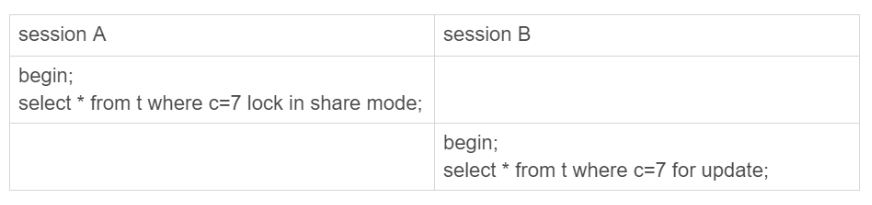
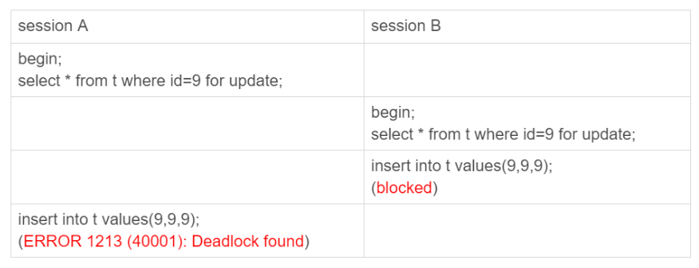

## mysql 幻读问题

首先初始化一张表,除了主键 `id` 之外,还有个字段 `c,d` 并且有索引 `index(c)`

然后插入 6 行数据 `(0,0,0),(5,5,5),(10,10,10),(15,15,15),(20,20,20),(25,25,25)`

### 什么是幻读

假设存在如下查询



可以看到事务 A 在 `T1,T3,T5` 都显式声明对 `d = 5` 加了读锁

然而 `Q1,Q2,Q3` 同样的语句查询 3 次返回的结果都不一样

其中, `Q3` 读取到 `id = 1` 这一行记录,被称作 **幻读**

1. 在可重复读级别下,普通的查询是 **快照读**, 也就是说是看不到其他事务提交的插入数据. 因此 **幻读** 是发生在 **当前读** 场景下的
2. 其中 `Q2` 读取到事务 B 的修改,是事务 A 在 **当前读** 场景下读取到的,并不是 **幻读**, **幻读** 特指 **新插入的行** 而不是 **发生修改的行**

### 幻读带来的问题

幻读首先破坏了事务 A **声明的语义**,事务 A 在 `T1` 时刻声明 **要把所有 `d = 5` 的行锁住,不允许其他事务进行操作** ,然而实际上其他事务仍然能够操作

假如事务 B 在 T2 时刻执行语句变为:
```sql
update t set d = 5 where id = 0;
update t set c = 5 where id = 0;
```

可以看到第二条语句将 `id = 0` 的数据行 `c` 值修改为 `5`

而事务 A 在 `T1` 时刻声明的 **将 `d = 5` 的记录,也就是 `T1` 时刻的 `id = 5` 的记录上锁; 而事务 B 的第二条记录,不仅仅会修改 `id = 0` 的行,还破坏了事务 A 对 `d = 0` 记录加锁的声明

其次,还破坏了 **数据的一致性**

对事务 A 的 `T1` 时刻后面追加一条语句,`update t set d = 100 where d = 5`

这里事务 A 的声明很合理,我对 `d = 5` 的记录声明加锁,就是为了在后面更新这个记录


此时,数据库的状态如下:

1. T1 时刻, `id = 5` 的数据行变为 `5,5,100` 这个变更要等到事务 A 在 T6 时刻才提交生效
2. T2 时刻, `id = 0` 的记录变为 `0,5,5`

此时 `binlog` 日志里面的内容如下:

```sql
/*事务 B*/
update t set d=5 where id=0; /*(0,0,5)*/
update t set c=5 where id=0; /*(0,5,5)*/

/*事务 A */
update t set d=100 where d=5;/*所有d=5的行，d改成100*/
```

这个时候,如果把主库当中的 `binlog` 日志文件发送到其他从库执行,或者说用这份 `binlog` 文件去重建一个数据库,都会发生数据不一致的问题

因为不仅仅是 `id = 5` 的记录其 `d` 值被修改为 `100` 了,事务 B 自己提交的 `id = 0` 的记录也因为后提交事务 A 的更新操作,导致其 `d` 值变为 `100`, 从而产生了数据不一致的问题

### 幻读导致的数据不一致问题究竟是如何引入的

很明显, `T1` 时刻事务 A 声明对 `d = 5` 的加锁就是不合理的

如果事务 A 将扫描过程中遇到的记录行都加锁,即不仅仅对 `id = 5` 的记录加锁,在这之前的记录也加上锁,相当于锁住了 `id = 5` 和 `id = 0` 两条记录

此时事务 B 对 `id = 0` 记录的更新就会被阻塞,这样就得等到事务 A 在 `T6` 时刻提交后事务 B 才能继续执行

如果事务 C 的执行语句变为如下:
事务 C 执行语句变为:
```sql
insert into t values(1,1,5);
update t set c = 5 where id = 1;
```



`binlog` 的内容如下:

```sql
/*事务 C*/
insert into t values(1,1,5); /*(1,1,5)*/
update t set c=5 where id=1; /*(1,5,5)*/

/*事务 A*/
update t set d=100 where d=5;/*所有d=5的行，d改成100*/

/*事务 B*/
update t set d=5 where id=0; /*(0,0,5)*/
update t set c=5 where id=0; /*(0,5,5)*/
```

可以看到对于事务 B 它在 `binlog` 里面的顺序是正常的, `id = 0` 的记录的 `d` 确实没有被事务 A 影响到; 但是事务 C 插入的新纪录 `id = 1` 的 `d` 还是被事务 A 影响到了

**即使事务 A 对扫描到的行都加了锁**,仍然没有阻止 **幻读** 的产生,因为加锁的时候都没有 `id = 1` 这一行记录!

### 如何解决幻读

上面结论告诉我们,简单地对扫描的行加上 **行锁** 是无法阻止 **幻读** 的产生的,因为幻读是在 **行与行之间的间隙** 里面插入新数据产生

因此 InnoDB 只好引入新的锁,称为 **间隙锁(Gap Lock)**,就是用来对两个值之间的间隙加锁,对于开头初始化的 6 行数据,一共有以下 7 个 **间隙**


当事务 A 执行 `select * from t where d=5 for update` 语句时,不仅仅对 `id = 5` 的记录加锁,还对间隙 `(0,5)` 也加上了 **间隙锁**

行锁之间的冲突,是 **另外一个行锁**; 间隙锁之间的冲突,是 **往间隙锁当中插入一条新纪录** 这个动作,因为间隙锁之间是不相交的

例如存在如下两个事务:



此时事务 B 是不会被阻塞的,因为表里面没有 `c = 7` 的记录,所以事务 A 的间隙锁是锁住 `(5,10)` 之间; 而事务 B 的间隙锁也是锁住 `(5,10)` 的区间; 不同的事务可以锁住同一个间隙,它们都在保护 **不允许往间隙里面插入新的记录**

### Next-key Lock

行锁和间隙锁合称 **Next-key Lock**,每个 **Next-key Lock** 都是 **左开右闭** 区间

**Next-key Lock** 的引入解决了 **幻读** 问题,但是 **Next-key Lock** 使用不当还会导致更严重的 **死锁问题**; 因为间隙锁的引入会扩大锁的影响范围,影响到了系统的并发度

例如有如下两个事务:



1. 因为数据库里没有 `id = 9` 的记录,所以事务 A 锁住了间隙 `(5,10)`
2. 同上,事务 B 也锁住了间隙 `(5,10)
3. 此时事务 B 试图插入一行记录 `(9,9,9)`, 由于事务 A 的间隙锁,导致事务 B 被阻塞
4. 同上事务 A 的插入操作也会被事务 B 的间隙锁阻塞,最终导致了死锁产生; 主动死锁检测立马报错让事务 A 返回了

