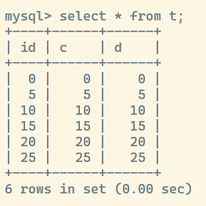
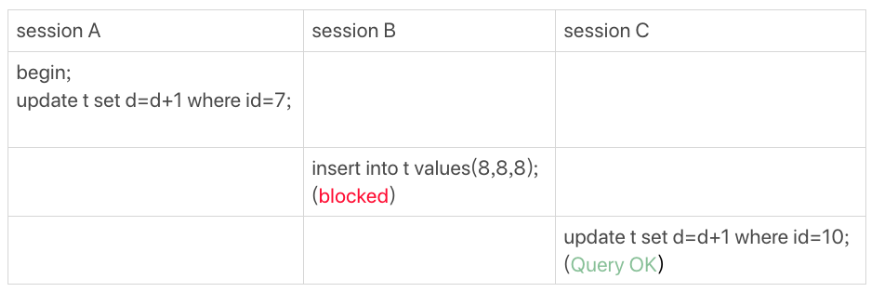
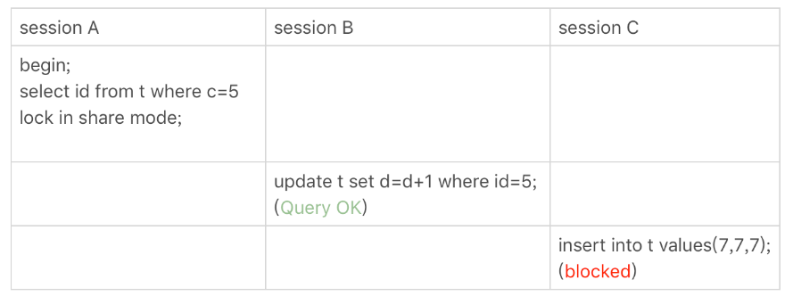
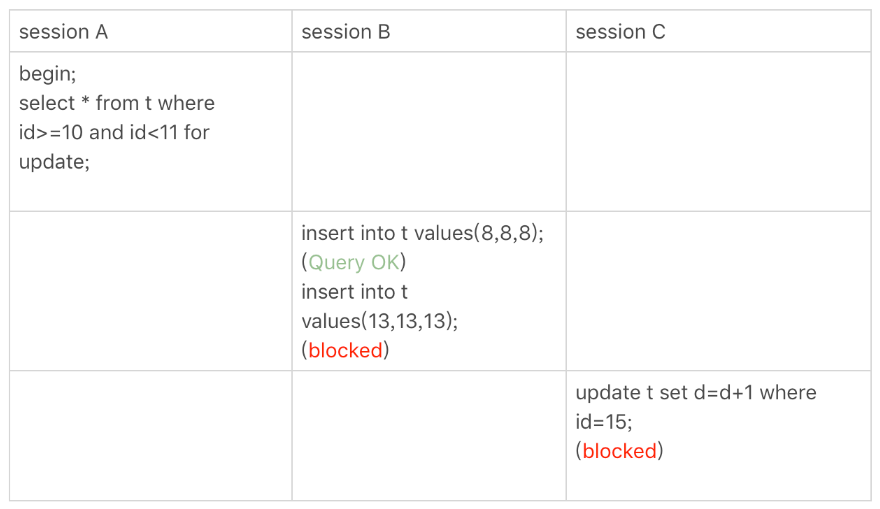
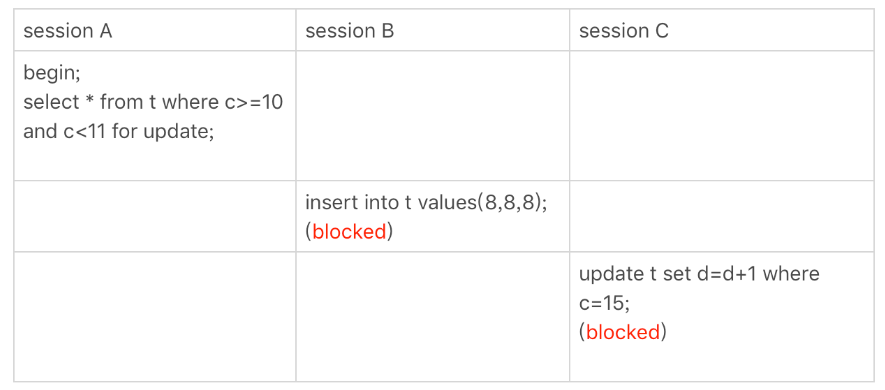

## mysql 加锁规则

总的来说,mysql 的加锁规则包括 **两个原则,两个优化,一个 BUG**

1. 原则1: 加锁的基本单位是 **Next-key Lock** 锁,是 **前开后闭** 的全进
2. 原则2: 查询过程当中,访问到的对象才会加锁; 没有访问到的对象是不会加锁的
3. 优化1: 索引上的 **等值查询**,给 **唯一索引** 加锁的时候, **Next-key Lock** 会退化为 **行锁**
4. 优化2: 索引上的 **等值查询**, 向右遍历到第一个 **不满足等值条件** 的时候, **Next-key Lock** 会退化为 **间隙锁**
5. 一个 BUG: **唯一索引** 上的 **范围查询** 会访问到第一个 **不满足条件** 为止

仍然以之前的数据为例

### 等值查询的间隙锁

由于表中没有 `d = 7` 的记录,按照加锁规则分析如下:

1. 原则 1 告诉我们,加锁的基本单位是 **Next-key Lock** ,事务 A 加锁的范围是 `(5,10]`
2. 优化 2 告诉我们,这是一个 **等值查询**,且 `d` 没有唯一索引 第一个不满足的条件是 `id = 10`,因此 **Next-key Lock** 会退化为间隙锁,最终加锁范围是 `(5,10)`

因此事务 B 往间隙 `(5,10)` 里面插入 `id = 8` 的记录会被阻塞; 而事务 C 更新 `id = 10` 的记录是成功的,因为事务 A 的间隙锁没有锁住 `id = 10` 的记录

### 非唯一索引的等值查询

1. 根据原则 1 ,加锁基本单位是 **Next-key Lock** ,因此事务 A 加锁间隙为 `(0,5]`
2. 由于索引 `c` 不是 **唯一索引**,根据优化 2 会遍历到第一个不满足的条件位置; 第一个不满足的记录是 `id = 10`,所以 `(5,10]` 也要加上间隙锁
3. 还是根据优化 2 , **Next-key Lock** 会退化为间隙锁,所以做种加锁区间为 `(5,10)

由于间隙锁 `(5,10)` 的存在,事务 C 插入记录 `(7,7,7)` 肯定会被阻塞

需要注意的就是,`lock in share mode` **意向共享锁** 并不会锁定主键索引,所以事务 B 能够更新 `id = 5` 的记录; 如果是 `for update` **意向排他锁** 这个时候不仅仅会锁定 **覆盖索引** 连对应的主键索引也都会被锁上

这说明,**锁** 实际是锁住的 **索引**

### 主键索引上的范围查询

1. 事务 A 的间隙锁为 `(5,10]`,根据优化 1 ,**唯一索引** 会退化为行锁,所以事务 A 只锁住了 `id = 10` 一行记录
2. 范围查询会继续往后查找,第一个不满足条件的记录 `id = 15`,根据原则 2 访问过的数据都要加锁,因此间隙锁为 `(10,15]`
3. 最终事务 A 的锁为 `id = 10` 的行锁,和 `(10,15]` 之间的间隙锁,即 `[10,15]`

### 非唯一索引的范围查询

1. 事务 A 的间隙锁为 `(5,10]` ,由于 `c` 不是 **唯一索引** 所以不会退化为行锁
2. 范围查询会继续往后查找,第一个不满足条件的记录 `id = 15`,根据原则 2 访问过的数据都要加锁,因此间隙锁为 `(10,15]`
3. 最终事务 A 的锁为 `(5,15]`

所以事务 B 和事务 C 自然都会被阻塞