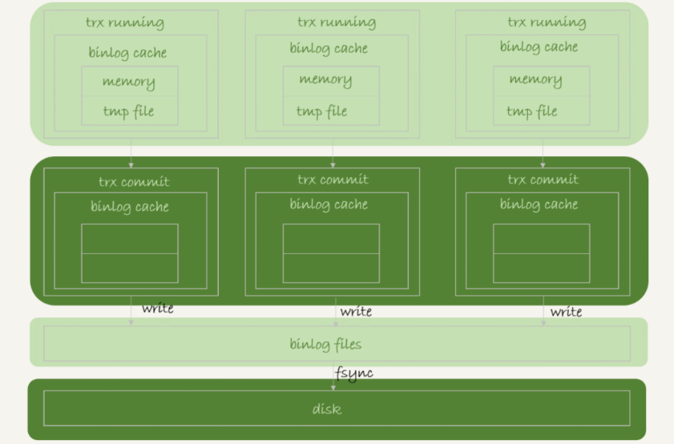
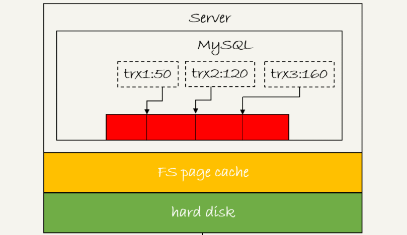
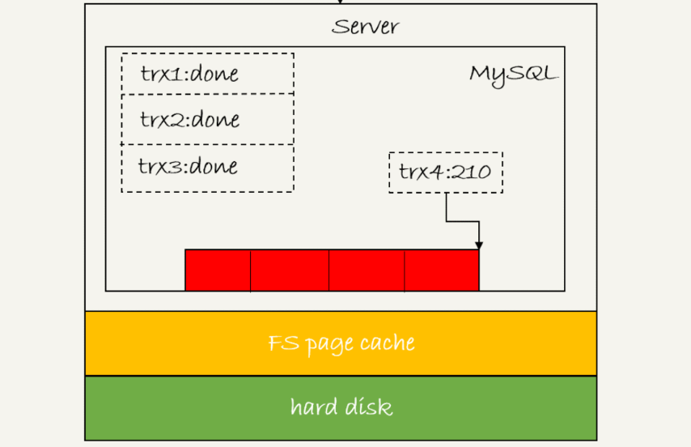

## mysql 如何保证高可用

有个基本概念,就是 mysql 只要 `redo log` 和 `binlog` 写入磁盘后,就能保证数据库发生宕机后能够正确恢复

### binlog 的写入时机

`binlog` 的写入逻辑: **在事务执行的过程当中,先把日志文件写到 `binlog cache`, 在事务提交时,将 `binlog cache` 的内容写入到磁盘的 `binlog` 文件当中**

由于一个事务是不能够拆分的,因此无论事务多大,都必须保证一次性写入; 对于 `binlog cache` 内存大小的分配,就需要考虑合理问题

可以看到每个 mysql 线程都有自己独有的 `binlog cache` 空间,但是所有线程共用一个 `binlog` 文件

其中 `write` 是把日志写入文件系统的 `page cache` 还没有持久化到磁盘,这个操作是纯内存操作,速度很快

`fsync` 才是持久化到磁盘的操作,这才是消耗磁盘 `I/O` 的大头

而 `write` 和 `fsync` 的时机,由参数 `sync_binlog` 控制

1. `sync_binlog = 0` 表示每次事务提交时都只 `write`,不 `fsync`; 这样 mysql 性能最高,但是发生宕机后,会丢失大量数据
2. `sync_binlog = 1` 表示每次提交事务都会执行 `fsync`; 这样 mysql 的性能最低,但是数据的可靠性最高
3. `sync_binlog = N (N > 1)` 表示每次提交事务后都 `write`,但是要累积 `N` 个事务后才执行 `fsync`; 这样 mysql 在性能和数据可靠性上最平均,发生宕机后只会丢失 `N` 个事务

### redo log 的写入时机

同样,`redo log` 也是先写入 `redo log buffer` 当中; 可见 mysql 处处都是 **尽可能利用内存**

与 `binlog` 类似,也存在三个阶段

1. 写入 `redo log buffer` 当中
2. `write` 写入文件系统的的页缓存当中,还并没有持久化到磁盘上
3. `fsync` 将文件系统页缓存持久化到磁盘

InnoDB 有参数 `innodb_flush_log_at_trx_commit` 控制刷盘时机

1. `0`: 每次事务提交时都只写入 `redo log buffer` 当中
2. `1`: 每次事务提交时都执行 `fsync` 持久化到磁盘上
3. `2`: 每次事务提交时都执行 `write` 写入文件系统的页缓存当中

InnoDB 有一个后台线程,每间隔 1 秒就会将 `redo log buffer` 当中的日志调用 `write` 写入文件系统的 `page cache`,然后调用 `fsync` 持久化到磁盘当中

### redo log 的两阶段提交

在时序上, `redo log` 先写入 `prepare` 状态,再写 `binlog`,最后 `redo log` 再写 `commit` 状态

如果 `redo log` 刷盘参数被设置为 `1`,那么 `prepare` 状态写入后就必须要刷盘,因为数据恢复需要用到 `prepare` 状态的日志

**双 1** 配置下,一个事务提交前需要等待两次刷盘,一是 `redo log(prepare)` 二是 `binlog`

mysql 为了优化刷盘次数,使用了 **组提交** 机制,也就是说一次 `fsync` 刷盘可能会刷写多次 `cache` 或者 `buffer` 里面的日志

这是三个事务分别写入 `redo log buffer(prepare)` 后的状态

1. trx1 最先写完,被选为这一组的 `leader`
2. 等到 trx1 要写磁盘的时候, trx2 和 trx3 已经将日志写入到 `redo log buffer` 了,所以日志逻辑序号(LSN) 已经等于 160
3. trx1 写磁盘的时候,带着 `LSN = 160` 去调用 `fsync`,等 trx1 返回的时候, LSN 小于 160 的所有日志都已经完成的刷盘
4. trx2 和 trx3 不用再 `fsync` 可以直接返回了

可以看到,一次组提交内的日志越多,节约磁盘 `I/O` 效果就越好       