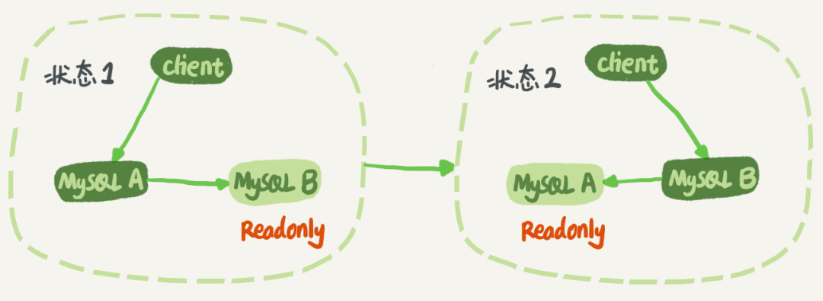
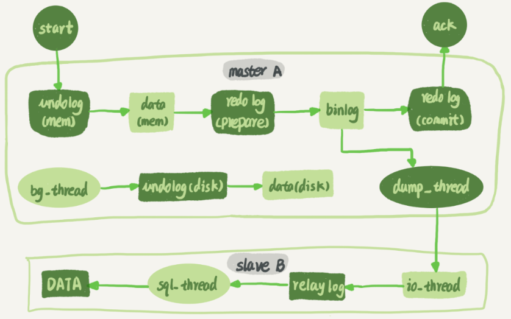
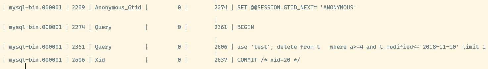
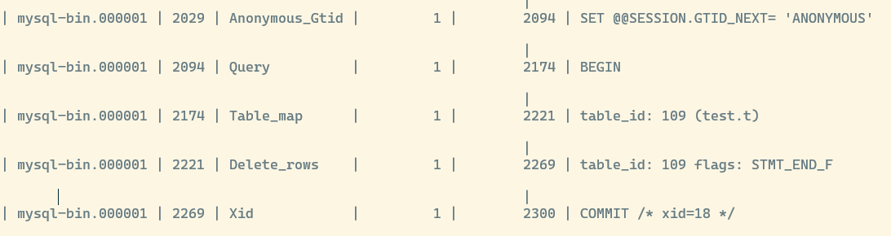
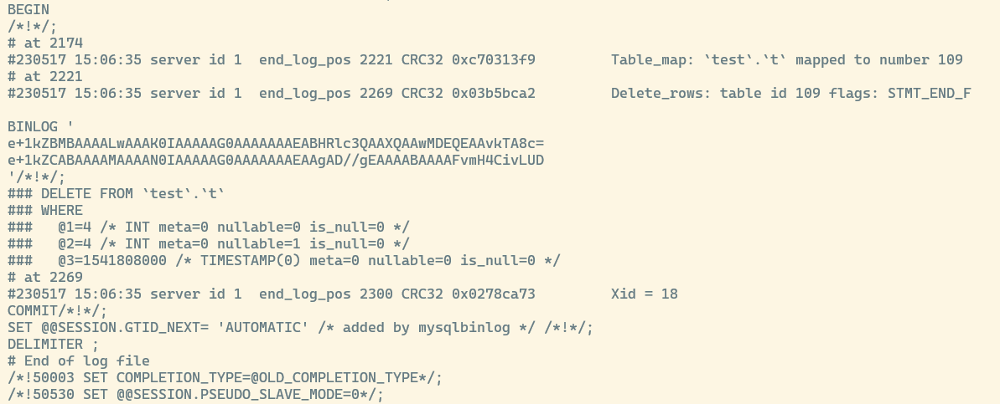
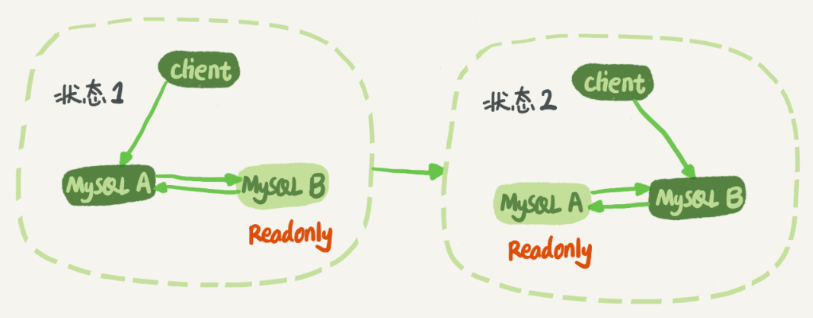

## mysql 如何保证主从一致的

首先了解 mysql 如何进行准备切换的



在状态 1 当中,客户端直接访问节点 A,节点 B 是 A 的从库,只同步节点 A 的更新到本地执行,这样可以保证节点 AB 之间的数据是一致的

当需要准备切换时,变为状态 2,此时客户端直接访问节点 B 节点 A 成了 B 的从库进行主从同步

假设此时在状态 1 ,节点 A 到节点 B 之间的工作流程如下:



在主从库之间,维持了一条长链接,主库 A 内部有一个专门的线程用于和从库 B 之间进行长链接

1. 从库 B 通过 `change master` 命令,设置主库 A 的连接信息,以及 **从哪个位置开始请求 `binlog`**,这个位置包含日志文件名和偏移量
2. 从库 B 执行 `start slave` 命令,此时从库会启动两个线程 `io thread` 和 `sql thread`,其中 `io thread` 用于和主库 A 建立长链接
3. 主库 A 接收到从库 B 的请求,开始读取本地 `binlog` 并通过长链接发送给从库 B
4. 从库 B 拿到主库发送的 `binlog` 之后,开始写入本地的中转日志 `relay log`
5. 从库 `sql thread` 开始解析 `relay log` 中转日志,并且执行里面的命令

### binlog 日志文件到底存放的是什么内容

`binlog` 有三种格式,一是 `statement`, 二是 `row`, 三是 `mixed` 也就是前两种的混合模式

建表后插入几条测试记录,然后执行一条删除语句

```sql
delete from t /*comment*/  where a>=4 and t_modified<='2018-11-10' limit 1;
```

#### statement 日志格式

通过命令 `show binlog events in 'mysql-bin.000001';` 查看具体的 `binlog` 内容



* 第一行,先忽略
* 第二行是一个 `BEGIN` 跟第四行的 `COMMIT` 相对应,表示这中间的语句是一个事务
* 第三行就是执行的语句了,其中的 `xid` 就是用来在 `redo log` 和 `binlog` 之间找到同一个事务以进行数据恢复

可以看到 `statement` 格式的 `binlog` 完整的记录了每一条原始指令,而且 mysql 还在前面加上了 `use test` 指定了对应的数据库,以及最后的 `limit 1` 语句

如果把这条 `binlog` 里面的语句复制出来手动执行,会得到一个 `WARNING` 警告,意思就是 `binlog` 当前设置的是 `statement` 模式,而且执行的语句里面包含 `limit` 这条语句是 `unsafe` 的,可能导致主从数据不一致

1. 如果主库执行 `delete` 时,优化器选择了索引 `a` ,那么会根据索引 `a` 找到第一条记录也就是 `a = 4` 这一行进行删除
2. 如果从库在同步执行 `delete` 时,从库的优化器选择索引 `t_modified`,那么就是删除的是 `t_modified = 2018-11-09` 也就是 `a = 5` 这一行数据

也就是说,使用 `statement` 格式的 `binlog` 进行主被同步时,有可能出现数据不一致的问题

### row 日志格式

将 `statement` 修改为 `row` 格式,重新执行上述语句后,查看 `binlog` 日志内容如下



可以看到 `row` 格式下,原始的 sql 语句没了,取而代之的是两条 `table_id` 的命令

* Table_map: 指定了接下来要操作的库表是 `test` 库的 `t` 表
* Delete_rows: 指定了是一个删除行为

通过工具 `mysqlbinlog` 查看从 `2029` 开始的日志详情如下:



通过 `row` 格式的 `binlog` 可以得到几个信息:

1. server id = 1 表示是在 `server_id = 1` 这个库上执行的
2. 每个 event 都通过 `CRC32` 进行校验
3. 每个实际操作的各个字段的值 `@1=4,@2=4` 等等,即第一个字段,第二个字段的具体值
4. 最后有 `Xid = 18` 表示这个事务被正确提交了

可以看到通过 `row` 格式记录的 `binlog` 日志,实际上记录了真实删除行的主键 `id = 4` ,这样将 `binlog` 传递到从库时,就肯定能够删除 `id = 4` 的记录,不会出现主从不一致的问题

### mixed 日志格式

1. 由于 `statement` 格式可能会导致主从数据不一致的问题,所以需要使用 `row` 格式
2. `row` 格式的缺点就是很占据磁盘空间,例如一个 `delete` 语句需要删除 100w 行数据,如果用 `statement` 格式就只用记录一条 `delete` 语句; 而如果使用 `row` 格式就需要详细记录这 100w 条记录的完整信息
3. 由于 `row` 格式会记录更多内容,不仅仅占用磁盘空间,还会占用 `I/o` 资源
4. 所以最后 mysql 提出了使用 `MIXED` 格式

在写入日志的时候,mysql 会自己判断当前命令是否会造成主从不一致; 如果会就写入 `row` 格式,如果不会,就写入 `statement` 格式

## 双 M 结构

实际上,在主从之间不是一条单向通道,更多的是双向,如下



这样两个节点 AB 之间就是互为主从,在实际切换的时候就不用再修改主从关系,只需要修改客户端的连接节点即可

### 双 M 结构下的循环复制问题

如果此时节点 A 执行了一条更新语句,把生成的 `binlog` 发送给节点 B

节点 B 执行完这条更新语句后,也会生成自己的 `binlog` 文件,由于互为主从,所以节点 B 的 `binlog` 也会发送给节点 A 去同步

这里就会导致两个节点之间互相循环执行同一条更新语句,最后导致循环复制的问题产生

结合 `row` 格式的日志文件看看如何解决循环复制问题

1. 首先每个节点自己的 `server_id` 都是不一样的,如果一样它们之间 **不能设定为主从关系**
2. 当一个从库连接到主库并接受 `binlog` 时,生成的与主库 `binlog` 的 `server_id` 相同的 `binlog`
3. 当一个实例接收到 `binlog` 进行重放时,首先判断 `server_id` 是否与自己相同; 如果相同则表示这个日志是自己生成的,就跳过重放这行日志

这样双 M 结构之间的主从同步流程就变为如下:

1. 节点 A 执行新的事务,并且节点 A 记录的 `binlog` 里面的 `server_id = 1`
2. 节点 A 的 `binlog` 传到节点 B 进行重放时,节点 B 对于重放日志生成的 `binlog` 记录 `server_id` 与日志里面保持一致,也就是 `server_id = 1`; 对于节点 B 自己的新事务则记录自己的 `server_id = 2`
3. 当节点 A 接收到节点 B 的 `binlog` 并进行重放时,发现有日志的 `server_id = 1` 表示时自己的生成的日志,此时节点 A 就会跳过重放这行日志