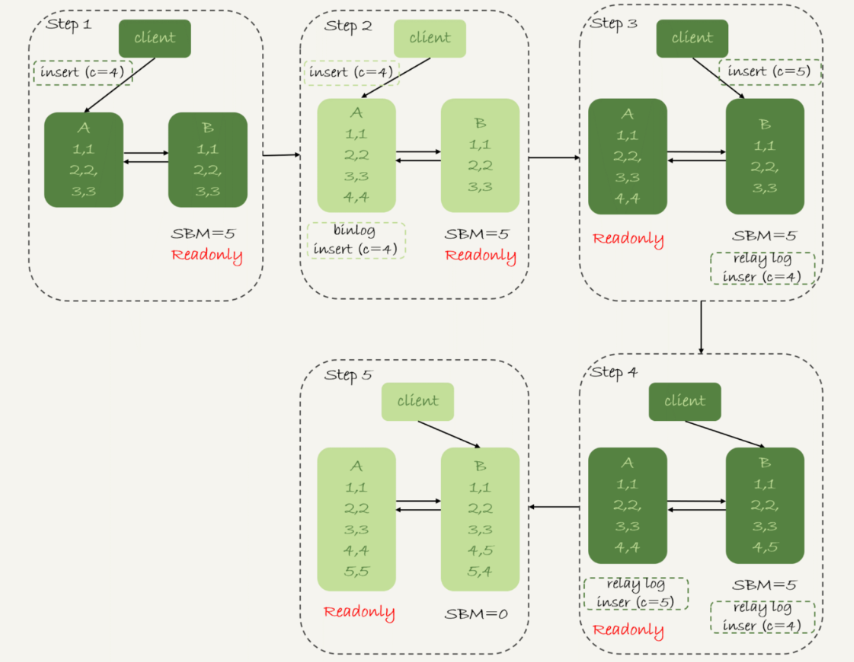
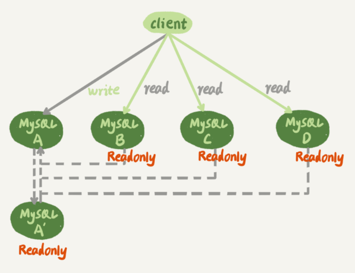

## mysql 如何保证高可用

### 主从延迟

任何同步机制,都会出现对应的延迟,数据同步主要关注的时间点如下:

1. 主库 A 执行完一个事务,写入 `binlog` ,此时记为 `T1`
2. 主库 A 将 `binlog` 传给从库 B, 从库 B 接收 `binlog` ,此时记为 `T2`
3. 从库 B 同步完这个事务,此时记为 `T3`

主从延迟,就是指 **同一个事务在主库和从库执行完成之间的时间差,也就是 `T3 - T1`**

mysql 计算主从延迟的方式:

1. 每个事务在 `binlog` 里面都有一个时间字段,记录了主库写入日志的时间
2. 从库取出当前正在执行事务的时间值,计算与当前系统之间的差值,得到 `seconds_behind_master`

主从库机器的时间设置会在从库上执行 `SELECT UNIX_TIMESTAMP()` 函数去校准

正常情况下,网络延迟是非常小的,也就是说 `T2 - T1` 的差值非常小; 主从延迟主要来源是从库接受完 `binlog` 到执行完事务之间的时间差

简单来说,主从延迟对外表现就是,**从库消费中转日志 `relay log` 的速度小于主库生成 `binlog` 日志的速度**

#### 主从库机器性能的差异

这种情况比较少,因为现在机器配置主从库之间都采用相同配置了; 因为主从切换时常发生,由性能较好的主库切换到性能较差的从库时,机器性能的差异会导致主从切换后系统的整体性能急剧下降

#### 从库经常做离线计算

很多场景是一些需要离线计算的或者需要长时间运行的统计任务,因为都是读多写少的人物场景,所以会把这些离线计算都放到从库上

这样反而加大了从库的压力,占用了大量 CPU 资源,造成主从延迟

常见的解决方案如下:

1. 采用一主多从的部署架构,将这些任务分散到多个从库执行,降低单个从库的压力
2. 接入外部系统,通过将 `binlog` 发送到第三方平台,例如 `Hadoop` 这样专门的大数据处理系统,让这些外部系统提供统计能力

其中一主多从是用的比较多的解决方案,因为这样从还提供了定期全量备份的能力

#### 大事务

假如一个事务要执行 10 分钟,这样主库就必须等到事务执行完成之后才能写入 `binlog`,而从库又需要 10 分钟才能同步完这个大事务; 这样就会导致主从延迟长达 10 分钟

一次性用 `delete` 语句就是一个典型的大事务场景

还有一种典型的大事务场景,就是 **大表上面做 DDL 操作**

### mysql 提供的两种策略保证高可用

#### 可靠性优先

在双 M 架构下,主从切换的详细流程如下:

1. 从库 B 检查当前的主从延迟,如果小于某个值就进行下一步,否则等待后重试检查
2. 将主库 A 修改为 `Readonly` 状态,即 `readonly = true`
3. 从库 B 继续检查当前主从延迟,直到主从延迟为 0
4. 将从库 B 的改为读写状态,即 `readonly = false`
5. 将客户端业务连接切换到从库 B

在这个主从切换的过程当中,是存在一段不可用时间的,也就是在 `2~3` 从库必须要等到主从延迟为 0 后才能进行切换; 所以在一开始就要判断当前从库的主从延迟不能过大,否则在这里就要等待很长的时间

这种场景下,会对业务有损 **(因为有等待主从延迟为 0 的时间必不可少)**; 但是对于数据库的主从库之间的数据,其一致性能够得到最大的保证

即 **业务有损,数据无损**

#### 可用性优先

如果说一个业务无法接受等待主从延迟为 0 的这一段有损时间,那么 mysql 提供了可用性优先策略

上述步骤的 `4,5` 调整到最开始,也就是从库不等待主从延迟的时间,直接进行切换; 这样整个系统就几乎没有不可用时间了; 但是这样就会导致主从库之间的数据不一致

考虑如下场景,主从库的表里面都有 3 条记录; 接下来客户端业务继续执行两条插入命令

```sql
insert into t(c) values(4);
insert into t(c) values(5);
```

同时当前主库有大量事务在做其他更新,导致主从延迟高达 5 秒,在第一条语句执行完成后,这时发生了主从切换



假设此时 `binlog` 是 `statement` 格式,也就是记录原始 sql 语句

1. 步骤 2 当中,主库 A 执行第一条 `insert` 语句,插入了数据 `c = 4` 也就是 `(4,4)`,然后开始主从切换,将 `binlog` 发送给从库 B
2. 步骤 3 由于存在 5 秒的主从延迟,此时从库 B 刚刚将日志存放到 `relay log` 还没来得及消费中转日志里面的内容,客户端第二条插入语句就来了
3. 步骤 4 新主库 B 执行了第二条 `insert` 语句,插入了数据 `c = 5`,也就是 `(4,5)`,并且把这个 `binlog` 也发送给了主库 A
4. 步骤 5 当中,新主库 B 消费中转日志,插入 `c = 4` 的新纪录,也就是 `(5,4)` ; 而旧主库 A 同步新主库的 `binlog` 插入新数据 `c = 5` 也就是 `(5,4)`

这时,由于 **可用性优先策略** 没有等待主从延迟,导致数据不一致的问题产生

假设 `binlog` 是 `row` 格式,这个时候还会出现数据不一致问题吗

由于 `row` 格式的 `binlog` 会记录新插入行的所有字段值

对于 A 来说,记录的是 `id = 4, c = 4`; 对于 B 来说,记录的是 `id = 4, c = 5`

此时新主库 B 消费 A 的日志 `id = 4, c = 4` 会产生主键重复错误; 旧主库 A 消费 B 的日志 `id = 4, c = 5` 也会产生主键重复的错误

由此可见,可以得到以下结论:

1. 采用 `row` 格式的 `binlog` 日志,数据不一致的问题能够更快被发现,而 `mixed` 或者 `statement` 格式数据不一致会悄悄地发生不会报错,当发现数据不一致时,很有可能已经连带造成很多其他数据也不一致了
2. 主从切换,**可用性优先策略** 可能会导致数据不一致问题; **可靠性优先策略** 会导致业务一段时间不可用

一般来说,都采用 **可靠性优先策略** 毕竟业务不可用可以重试,而数据不一致等到发现的时候很有可能已经造成了严重的数据错误

## 一主多从架构下的主从切换

大多数场景下,都是 **读多写少**,最常见的方案就是数据库的 **读写分离** ,一个常见的双 M 架构且支持 **读写分离** 的 **一主多从** 部署架构图如下



其中 A 和 A' 互为主从,之间双向同步; 其他 BCD 都是 A 的从库; 这样主库 A 就承担了所有 **写** 请求,其他从库 BCD 共同承担 **读** 请求

当这个架构下的主库 A 发生故障,需要主从切换时; A' 会成为新的主库,此时从库 BCD 需要把自己的主库修改为 A'; 由于涉及到多个从库的修改,这个主从切换的过程复杂性也随之增加

从库上需要执行 `change master` 命令,其中跟关键的两个参数就是 **日志文件** 和 **日志偏移量**

由于 A 和 A' 之间存在主从延迟,所以 A 和 A' 对于相同的事务日志,在 `binlog` 里面记录的位置页不一样; 此时从库 B 切换新主库的时候,就需要先 **找到这个同步位置**

一种常见的获取 **同步位置** 的做法:

1. 等待新主库 A' 的主从延迟为 0
2. 得到 A' 的最新 `binlog` 文件和最新日志位点
3. 取原主库 A 发生故障的时间 T
4. 通过工具得到 A' 日志文件 T 时刻的日志,得到 T 时刻 A' 的日志位点

