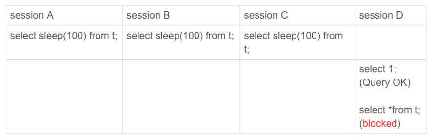

## 如何检测 mysql 实例是否是正常工作的

### select 1 方案

如果语句 `select 1;` 成功返回,只能说明数据库这个进程还在,但是并不能说明数据库还能够正常工作

考虑如下场景:



设置 mysql 的最大并发查询数为 3,限制只允许 3 个线程并发查询; 此时 `select 1` 能够成功返回,但是第四个查询语句却会被阻塞

这样实际上 mysql 是无法对外提供服务的,`select 1` 也无法检查问题

### 查表方案

考虑查询一张实际的表,以检测数据库是否能够提供正常的查询请求,例如 
```sql
select * from test.health_check;
```

这种方案能够检查出因为并发查询数打满导致查询的失效,但是仍然存在以下问题

如果 `binlog` 或者 `redo log` 日志被写满,此时所有的插入和更新语句都会被阻塞,但是查询时不受影响的

而查表方案无法检查出更新能力是否发生问题

### 更新方案

与查表方案类似,考虑更新一张实际的表,来监控更新能力是否发生问题
```sql
update test.health_check set updated_at = now();
```

由于双 M 结构会导致主从库之间互相同步,可能产生行冲突,最好是在 `health_check` 里面再添加一个当前实例的 `server_id` 列,每个实例只更新自己的 `server_id` 行; 这样可以避免主从同步之间的行冲突

这个更新方案是当前比较主流的检测 mysql 是否正常提供服务的手段,但是还存在一个 **慢更新** 问题

由于更新操作仅仅是更新一张与业务无关的表的一行记录,实际上这条更新语句会很快执行并且写入 `binlog` 日志然后同步给其他从库

如果有个实例的 CPU 和磁盘利用率非常高,此时每个请求都有可能获得系统调度

而一条更新指令需要的 CPU 资源非常少,轮到更新指令时,很快就执行完成并返回

这个时候监控系统会认为 mysql 是正常工作的,但实际上此时数据库很有可能面临的很大的负担

### mysql 内部检测

mysql 提供了一个内部的监控系统,可以监控数据库实例运行时的各种系统指标

可以使用 **更新方案** 配合 mysql 的 **内部检测** 一起判断一个数据库实例是否正常工作