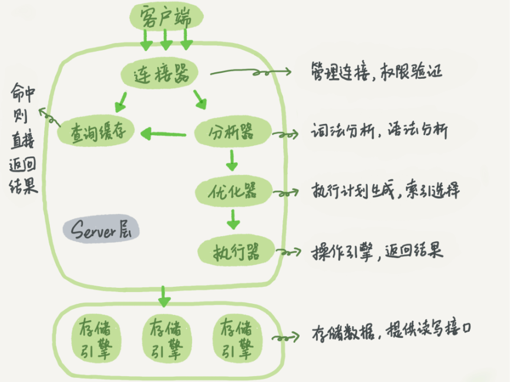

## mysql 基本组成结构

大致分为 6 个部分：

1. 连接器：负责维护客户端和 mysql 之间的连接，通过连接池复用和管理所有连接；也负责对客户端进行权限校验

2. 查询缓存：为了加快查询速度，命中缓存直接返回结果

一般情况下不需要打开查询缓存，因为一个小小的更新就会导致查询缓存失效，所以查询缓存的命中率非常低，且 mysql 官方在 8.0 之后的版本就移除了此功能

3. 分析器：词法、语法分析，检查 sql 语句是否存在语法错误
4. 优化器：生成执行计划，选择索引

优化器做的最关键的一个步骤就是 **选择索引**，尤其是在对多个索引列字段的查询上，mysql 优化器会选择出它认为最高效率的索引进行查询

大部分情况下优化器的选择都不会犯错，但是某些特殊场景下，优化器的索引选择仍然不是最优解

5. 执行器：操作底层存储引擎提供的 api，返回查询结果
6. 存储引擎：实际保存数据的地方，提供读写 api 给执行器调用
