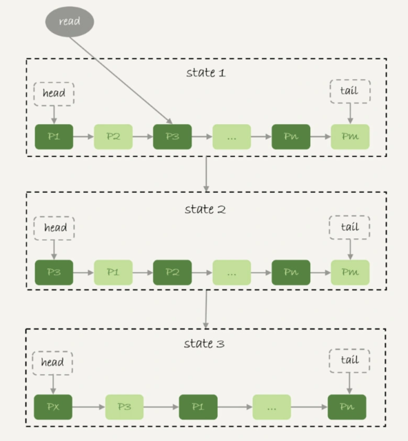
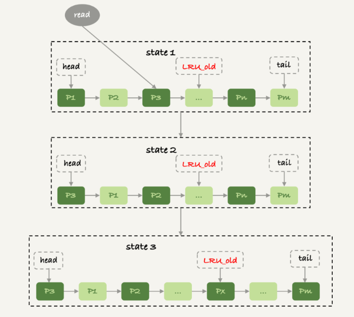

## mysql 扫描全表数据为何内存不会爆掉

mysql 的数据是保存在主键索引树的上的,所以全表扫描实际就是扫描整棵主键索引,然后放到一个 **结果集** 里面

实际上,mysql 并不需要保存一个完整的结果集,在获取数据和返回数据的流程如下

1. 获取一行数据,写入 `net_buffer` 这个大小默认是跟内存页一样 `16K`
2. 继续获取下一行数据,重复步骤 1 直到 `net_buffer` 被写满,然后调用网卡上的接口将数据发送返回到客户端
3. 如果发送成功,就清空 `net_buffer`,然后重复步骤 1,2
4. 如果发送失败,就进入等待,直到发送成功

这意味着 mysql 是 **边读边发** 的,如果说客户端接收数据的速度很慢,那么 mysql 就会因为发送不出数据而导致事务执行时间变长

客户端在建立 mysql 连接的时候,可以指定是否需要使用 **接收端缓存**

* -q 参数即 --quick ,表明客户端不使用 **接收端缓存**,那么数据就是读一行处理一行; 如果客户端业务复杂处理一行数据时间过长,就会导致 mysql 阻塞在发送数据这个步骤
* 不添加 -q 参数,表明客户端开启了 **接收端缓存**,这也是 **默认的连接参数**,此时客户端会将 mysql 返回的数据全部缓存到本地内存,这样 mysql 就可以一次性发送大量数据过来,而不是阻塞在发送数据这一步

如果说一个 **大查询** 占用了客户端大量内存,那么就不得不使用 `-q` 参数放弃客户端本地缓存了

### Buffer Pool 内存管理

mysql 在设计时一个很重要的原则就是,**尽可能多的使用内存,减少磁盘的操作以提高系统的性能**, mysql 通过 `buffer pool` 来管理内存,同时也起到了缓存的作用

由于有 `WAL(写前日志)` 机制,当事务提交的时候,磁盘上的数据页仍然是老数据,最新的变更是留在 `redo log` 日志里面的; 这个时候如果有一个查询马上到来,是否需要立即将 `redo log` 里面的变更 `merge` 到磁盘呢

并非需要立即 `merge`,由于此时内存里面的数据页已经是最新的版本,直接从内存里面返回查询结果,速度是非常快的,也减少了磁盘的操作; 只有当内存页慢的时候,才需要刷新脏页

与大多数缓存系统类似,mysql 管理内存换算也使用了 `LRU(最近最少使用)` 算法

### LRU

朴素 `LRU` 算法如下,通过一个单链表,维护缓存里面的内存页,将最近访问过的内存页放到链表头,那些最少访问的数据自然就慢慢地堆积在链表尾附近了

朴素 `LRU` 算法存在一个很致命的问题,那就是全量扫描的时候,缓存命中率急速下降,会导致 `LRU` 链表里面的数据快速置换

假设一个正在工作中的 `LRU` 缓存已经放满了若干内存页; 而全表扫描的数据又全部不在内存页里面,加上全表扫描每行数据只会被访问一次; 这样会导致 `LRU` 里面的缓存全部失效,一批又一批的被换进换出,此时磁盘性能急剧下降

实际上 InnoDB 采用了 **改良** 的 `LRU` 算法

改良 `LRU` 算法将整个链表按照 `5:3` 的比例分割为 `年轻代` 和 `老年代`,并且增加了一个 `LRU_old` 指针用于维护 `老年代` 的开始位置

改良 `LRU` 算法的执行流程如下:

1. 需要访问数据页 P3,由于 P3 处于年轻代,所以将其移动到链表头部
2. 之后需要访问一个不存在于 LRU 的数据页,依然淘汰的时链表尾部的数据页
3. 新换入的数据页并不是直接放到 LRU 的头部,而是放到老年代的头部,即 `LRU_old`
4. 每次访问年轻代的数据页,就按照步骤 1~2 执行; 每次访问老年代的数据页时,有以下判断

    a. 如果这个数据页在老年代已经存活超过了 N 秒,则把它加入年轻代头部
    b. 如果这个数据页在老年代存活时间不足 N 秒,则它仍然处于老年代头部

这样,全表扫描在改良 `LRU` 算法下,每个数据页的存活时间都很短暂,因此它们都只能进入到老年代,而老年代的数据很快就会被淘汰出去,这样它们对年轻代的数据影响就很小,从而保证了那些频繁命中的年轻代数据能够一直活跃在 `LRU` 缓存里面,保证了系统缓存的命中率

**BTW,这个跟 redis 的改良 `LRU` 算法很类似,都划分了年轻代和老年代**