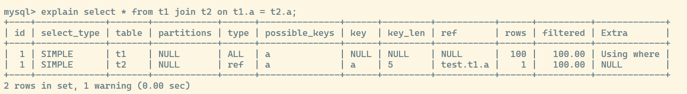
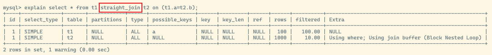

## join 关键字应该怎么用才好

初始化 `t1,t2` 两张表,包含 `id,index(a),b` 三个字段,其中字段 `a` 有索引, `t1` 表有 1000 条记录,`t2` 表有 `t1` 表的前 100 条记录

有如下查询
```sql
select * from t1 join t2 on t1.a = t2.a;
```

执行过程如下:



其中,`t1` 作为 **驱动表**,`t2` 作为 **被驱动表**; 可以看到 `t2` 表里面使用到了索引 `a`,因此这个语句的执行流程如下:

1. 从 `t1` 表里面获取一行数据 R
2. 从 R 里面取出字段 a 放到 `t2` 表面查询
3. 从 `t2` 表里面得到满足条件的查询语句,取出数据与 R 组成一行一起放入结果集
4. 重复步骤 1~3, 直到循环完 `t1`

这个过程与 `for 循环嵌套 for` 循环很类似,而且由于 **被驱动表** 可以使用索引,所以这种算法称为 `Index Nested-Loop Join` 简称 `NLJ`

在这个嵌套查询里:

* 其中 `t1` 表是全表扫描,所以扫描了 100 行记录
* 对于 `t1` 里面的每一行 R,根据字段 a 查询 `t2` 表,也是走的 `t2` 表的索引树,由于构造数据是一一对应的,所以每次 `t2` 表需要扫描一行数据,总共扫描 100 行
* 综上所述,查询一共扫描了 200 行数据

如果不使用 `join` 关键字,单表查询就需要先查询 `t1` 的所有数据,然后遍历在查询 `t2` 的对应记录

总共也扫描了 200 行记录,但是执行了 101 次查询,比使用 `join` 关键字多出了 100 次交互

### 如何选择 join 的驱动表

一个原则,使用 **小表驱动大表**,只不过这个原则的前提是 **被驱动表能够使用索引**

如果 sql 改成如下:
```sql
select * from t1 join t2 on t1.a = t2.b
```
由于 `t2` 表里面 `b` 字段没有索引,因此在扫描 `t2` 表的时候会走全表扫描,这样这个 sql 扫描的总行数就等于 `100*1000` 多达 10 万行数据

这个算法被称为 `Simple Nested-Loop Join`,实际上 mysql 在这种 **被驱动表无法使用索引** 的时候,用的是改良后的算法,叫做 `Block Nested-Loop Join` 简称 `BNL`



这里由于 mysql 的优化器会优化驱动表的选择,有可能选择 `t1` 也有可能选择 `t2`,使用语句 `straight_join` 强制走固定的 `join` 方式,即字面表达的 `t1` 驱动 `t2`

### BNL

当 **被驱动表无法使用索引时 `BNL` 的算法流程如下

1. 将驱动表 `t1` 放入线程缓冲内存当中 `join buffer`,由于语句是 `select *` 因此整张 `t1` 表都被放入内存
2. 扫描被驱动表 `t2` ,取出每一行跟 `join buffer` 里面的数据作对比,如果满足 `join` 条件,则加入结果集

可以看到逻辑上和 `SNL` 没什么区别,都是 `嵌套 for 循环`,扫描了 10 万行数据

但是 `BNL` 是在内存里面进行的判断操作,速度上会比直接访问磁盘页扫描索引树更快,性能也更好

在 **被驱动表无法使用索引** 的场景下,小表或者大表做驱动表的性能是一样的

### BNL 的分段查询

如果说驱动表过大,或者驱动表查询的行数过多,那么 `join buffer` 很有可能放不下那么多数据

此时执行流程就会变为 **分段放入**

1. 扫描驱动表,放入若干行数据到 `join buffer`
2. 查询被驱动表,满足条件的放入结果集
3. 清空 `join buffer` 从下一个位置开始继续扫描驱动表,重复 1~2 直到结束扫描

这也体现了算法 `Block` 的含义,即 **分块,分段**

由于使用了 `join buffer` 这个有限的资源,理论上将小表放入内存的开销也比大表更少

所以总结结论,**使用 `join` 是最好使用小表作为驱动表**

这里的 **小表** 实际上也是个相对概念

在决定哪个表做驱动表的时候,应该是两个表按照各自的条件过滤

过滤完成之后,计算参与 `join` 的各个字段的总数据量,**数据量小的那个表,就是小表**,应该作为驱动表