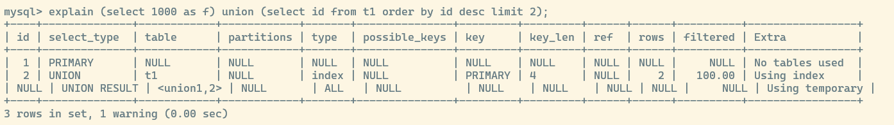
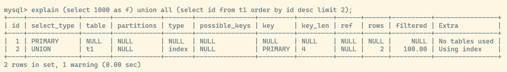
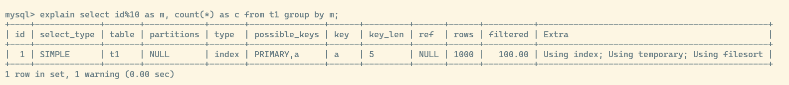

## mysql 使用临时表的场景

之前提到过多个辅助数据结构用于缓存执行过程当中的中间数据

* sort buffer: 进行 `sort` 排序的时候会用到
* join buffer: 进行 `join` 连接查询的时候会用到
* 临时表: 进行 `order by` 的时候 **可能** 会用到

### union 

初始化 `t1` 表数据,插入 1000 条记录,并执行以下 sql 语句
```sql
(select 1000 as f) union (select id from t1 order by id desc limit 2);
```

执行过程如下:



可以看到第三行里面 `Extra` 字段有 `Using temporary` 表示使用到了 **临时表**

这条 sql 的执行流程如下:

1. 创建一个内存临时表,仅有一个整型字段 f, 且这个 f 是表的主键字段
2. 执行第一个子查询,将 1000 插入临时表
3. 执行第二个子查询,开始遍历 `t1` 表

    a. 拿到第一行数据, `id = 1000` 插入临时表时违反了主键的唯一性约束,失败
    b. 拿到第二行数据, `id = 999` 插入临时表成功
4. 从临时表里面取出数据,返回结果集,然后清理临时表

可以看到此时临时表的作用,**暂存了数据**,并且还用到了 **主键的唯一性约束**, 实现了 `union` 取 **并集** 的语义

如果修改为 `union all` 则失去了 **并集** 的 **去重** 效果,此时执行流程就依次执行子查询,将得到的结果直接作为结果集的一部分,不再需要临时表暂存数据了



### group by

`group by` 也是一个常见的使用临时表的例子,考虑如下 sql 语句:
```sql
select id%10 as m, count(*) as c from t1 group by m;
```

执行过程如下:


* Using index: 表示使用了覆盖索引,很容易理解 `count(*)` 会选择一棵最小的索引树来遍历, 索引 `a` 里面也包含了主键信息,自然就用索引 `a` 来进行遍历,也正好用到了覆盖索引的优化机制
* Using temporary: 表示用到了临时表
* Using filesort: 表示需要使用 `sort buffer` 来辅助排序

执行流程如下:

1. 创建临时表,包含两个字段 `m` 和 `c` 主键是 `m`
2. 扫描 `t1` 表的索引 `a` ,依次取出主键 `id` 值,并计算 `id%10` 的结果记为 `x` 放入临时表

    a. 如果临时表主键 `m` 不存在 `x` 的值,就在插入新纪录 `(x,1)`
    b. 如果临时表主键 `m` 已经存在 `x` 的值,就更新 `c` 值加 `1`
3. 扫描完索引 `a` 之后,再利用 `sort buffer` 在临时表上对字段 `m` 做排序,将排序后的结果返回

与排序类似,如果 **内存临时表** 放不下那么多数据,就会使用 **磁盘临时表**