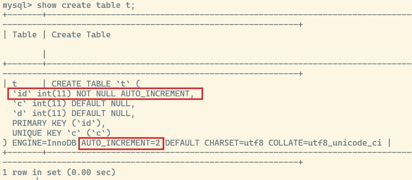
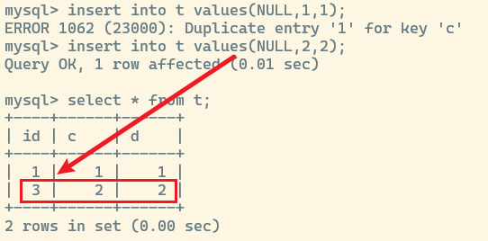

## mysql 自增主键问题

主键为什么要自增长? 

**主键自增是为了尽可能地保持递增顺序插入,使索引树更加紧凑,避免内存空洞** 

但是自增主键仍然会出现 **空洞** 的现象,考虑如下表 `t1` 包含字段 `主键id, index_unique(c),d`

使用命令 `insert into t values(NULL,1,1);` 插入一行命令后,再查看表结构

但实际上,InnodDB 的自增值是保存到内存里面的,直到 8.0 的版本才放到 `redo log` 里面保存

### 自增值的修改机制

如果要插入的 `id` 值为 X,当前自增值为 Y

1. 如果 `X<Y`, 那么自增值不变
2. 如果 `X>=Y`, 那么自增值修改为新的自增值

其中新的自增值的生成算法为: **从当前自增值开始,以 `auto_increment` 为步长,直到找到第一个大于 X 的值作为新自增值**, `auto_increment` 默认情况是 `1`

这样上述条件就变为:

1. 如果 `X<Y`, 则自增值不变
2. 如果 `X>=Y`, 则自增值变为 `X+1`

这样如果 X 在 Y 后面,那么就会出现 `Y-X` 的自增值空洞

并且自增值的修改操作是在数据真正执行插入之前,假设表已经存在 `(1,1,1)` 的记录,此时执行语句插入 `insert into t values(NULL,1,1)`

1. 执行器调用 InnoDB 接口写入数据,传入 `(0,1,1)`
2. InnoDB 发现没有指定主键 `id`,获取当前表自增值为 `2`
3. 将传入数据行修改为 `(2,1,1)`,同时自增值 `+1` 修改为 `3`
4. 由于列 `c` 存在唯一性约束,所以插入报错

可以看到这个时候因为唯一性约束导致数据插入失败,但是自增值却已经修改为 `3` 了,即 `id = 2` 已经成为 **数据空洞**

### 事务回滚也会导致自增值空洞

mysql 为了性能考虑,在事务回滚时,并不会回滚已经修改的自增值,为了保证自增值唯一,每个事务在申请自增值时,肯定都会加锁,这个锁称为 **自增锁**

处于性能考虑,对于批量插入的场景,同一个 sql 语句申请到的自增值以 2 的幂次递增

1. 第一次申请 1 个
2. 第二次申请 2 个
3. 第三次申请 4 个

以此类推,如果某一次批量插入的数据量小于 `2^(n-1)` 个,那么下一次申请的自增值就是从 `2^n` 开始计算,这样就会浪费中间部分自增值