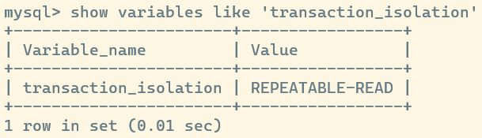
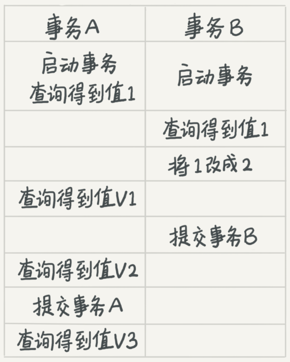
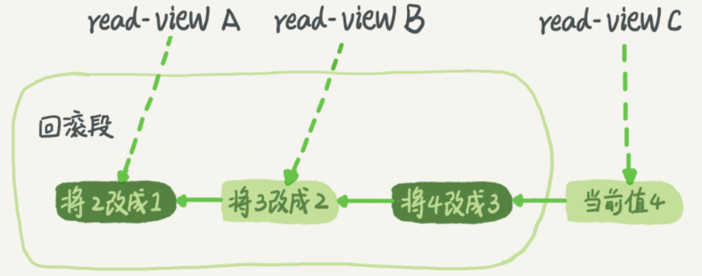

## mysql 事务的隔离性

事务的四大特性 `ACID`

* A: 原子性,事务保证了一组操作要么全部执行成功,要么全部执行失败,不会出现部分成功部分失败的场景
* C: 一致性,执行事务的前后保证数据一致
* I: 隔离性,并发访问数据库时,一个事务不会被其他事务干扰
* D: 持久性,一个事务被提交过后,对数据库的更改就是持久的,即使发生了故障

### mysql 事务的四大隔离级别

1. 读未提交: 最低的隔离级别,一个事务可以读取到其他还未提交事务的修改结果
2. 读已提交: 一个事务只能读取到其他已经提交的事务的修改结果
3. 可重复读: **mysql 的默认隔离级别** 一个事务在执行过程中看到的数据,总是跟这个事务启动时的读取到的事务保持一致

4. 串行化: 最严格的隔离级别,任何读或者写操作都会加锁保证穿行读取

**读已提交**

`V1` 事务 B 还没有提交,所以 `V1=1`

`V2` 事务 B 已经提交,所以 `V2=2`

`V3` 事务 A 提交,再次查询有 `V3=2`

可以看到,在事务 A 提交之前,已经能够读取到事务 B 提交的修改

**可重复读**

`V1` 事务 B 还没有提交,所以 `V1=1`

`V2` 事务 B 已经提交,但是在 **可重复读** 级别下,事务 A 在执行过程中读取到的数据应当和启动事务之前看到的数据保持一致,所以 `V2=1`

`V3` 事务 A 提交,再次查询有 `V3=2`

对于 **读已提交** 和 **可重复读** 来说,最大的区别就是在一个事务执行的过程中,能否访问到其他已经提交事务的修改

**可重复读** 级别下,事务在执行过程中访问到的数据和启动事务时访问到的数据保持一致 **(即使这个过程中其他事物修改了数据并且提交)**

### mysql 如何保证可重复读

实际上,mysql 在查询时会创建一个 **视图** 的东西来保证事务之间的隔离性

对于 **读未提交**,不创建视图,直接返回数据的最新记录

对于 **读已提交**,视图在执行 sql 之前创建

对于 **可重复读**,视图在创建事务的时候创建

对于 **串行化**,也不创建视图,通过加锁的方式实现

### 事务隔离的具体实现

mysql 在对每条数据的修改时,都会记录一条 **回滚日志**,当前记录的最新值加上 **回滚日志** 的操作就可以恢复到修改前的状态

如果将一个数据 1 连续变更为 2,3,4 那么 mysql 会记录如下 **回滚日志**

对于启动时间不同的事务,其创建的视图也会因为 **回滚日志** 的不同而不同

