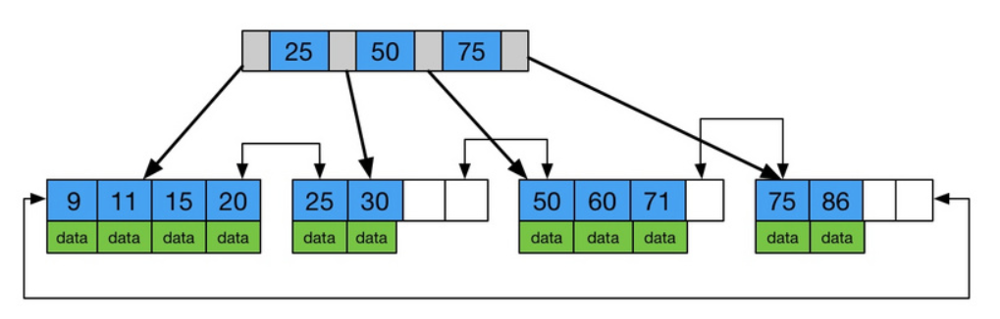
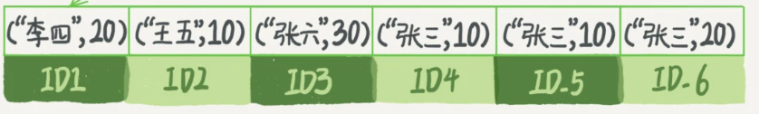
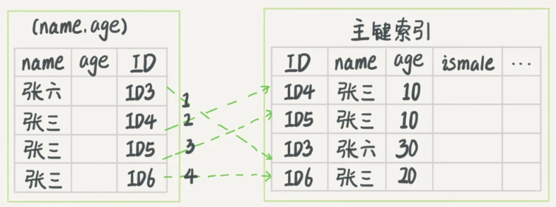
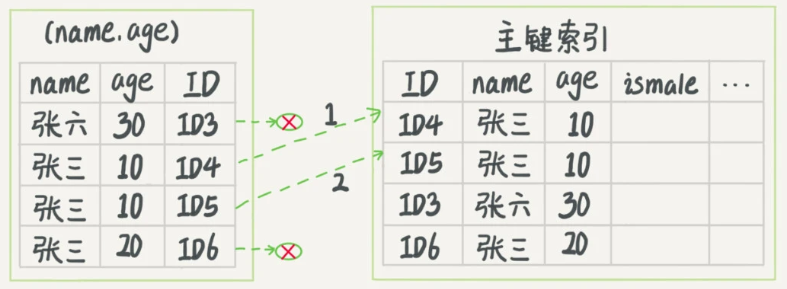

## mysql 索引

### 索引的常见模型(索引的演化)

1. 最常见的索引结构就是 k-v 哈希

只要输入 `key` 通过哈希算法后就能得到一个唯一的 `k` ,这样就能在词典里面检索是否存在 `k`

其缺点就是存在 **哈希碰撞**,也就是说若干个不同的 `key` 经过哈希算法后得到了同一个 `k`

处理 **哈希碰撞** 的方法有:下一个空位置,re-hash和使用最多的 **拉链法**

k-v 哈希结构在处理 **等值查询** 的场景下,性能非常优秀,时间复杂度只有 `O(1)`

缺点也很明显,因为哈希函数是无序的,无法处理范围查询,对于 `a>1` 这样的范围查询无法通过遍历哈希得到

2. 还有一种比较常见的索引结构就是有序数组

有序数组由于连续性,处理 **范围查询** 和 **等值查询** 都有很好的性能

但问题也非常明显,对于数据的插入,删除其性能非常低

3. 二叉搜索树 (BST)

BST 的左孩子都比父节点小,右孩子都比父节点大,类似于二分查找,其查找时间复杂度为 `O(lng(n))`

由于索引文件不止存在于内存当中,还存在于磁盘当中,文件系统访问磁盘一般以 **页** 为单位,而二叉树每个节点保存的数据量较小,如果需要访问大量节点,且这些节点又分散在不同的 **页** 当中; 此时 mysql 就要进行大量的磁盘 `I/O` 操作,这会导致性能急剧下降

而且为了维护 `O(lng(n))` 的查询性能, BST 树会根据节点的增删进行自选保证整棵树的平衡,由于单个节点保存的数据较少,会导致自旋的次数增多,也会降低索引的查询性能

4. B 树

B 树在二叉树的基础上,变成了 N 差数, InnoDB 一棵 B 树差不多有将近 `1200` 个分叉,对于高度为 `4` 的 B 树,能够保存将近 `17亿` 的数据; 这样最坏的情况下,查询一个数据最多也就访问 `3-4` 次磁盘,大幅度降低了磁盘的 `I/O` 操作次数

这里引入了一个 **磁盘预读** 的概念,根据 **局部性原理: 读取一个数据那么接下来大概率还会读取这个数据附近的其他数据**,文件系统在从磁盘读取数据时,会把数据后面一个连续的 **页** 都从磁盘加载到内存; 这样对于当前数据附近的数据也就可以直接从内存中读取了

而 BST 树就是因为 **磁盘预读** 导致一 **页** 里面的有用数据太少,需要大量读取磁盘页,导致空间和时间的浪费

B 树在 BST 树的基础上,将一个节点的大小设置为一页的大小,这样每个节点能够保存的数据就变得更多,进而降低磁盘读取的次数

实际上 B 树只解决了空间上更合理的保存索引数据,对于范围查找的性能仍然不高,因为 B 树的检索只能通过二分查找+中序遍历完成,其时间复杂度仍然是 `O(n*lng(n))`

5. B+ 树

B+ 树在 B 树的结构上,在树底增加了一个全数据的双向链表



B 树的每个节点不仅保存了指向下一个节点的指针,还保存了当前节点的数据; 而 B+ 树的 **非叶子节点** 仅仅保存指向下一个节点的指针,只在 **叶子结点** 上保存具体的数据; 这样在同样大小的节点下,B+ 树比 B 树能够保存更多的节点信息 **(非数据)**

由于只在 **叶子结点** 保存数据,所以 B+ 树的数据检索只会发生在树底的双向链表上,这也导致 B+ 树的查询性能很固定

得益于双向链表的有序性,B+ 树在范围查找时,可以在 O(n) 的时间复杂度内得到范围查询的结果

### InnoDB 的索引模型

在 InnoDB 当中,表都是根据 **主键** 顺序索引的形式存放数据的,而且 InnoDBO 的索引使用的时 B+ 树,所以可以说表的数据都保存在 B+ 索引树上面

对于每个表来说,都有一张默认的 **主键索引树**,索引树里面每个 **非叶子节点** 只保存 **主键值**,只在 **叶子结点** 才保存 **主键值对应的数据** 

而 **非主键** 字段上建立的索引,其索引树都不保存具体数据,在树底的双向链表里面只保存了 **字段-主键** 的对应关系

由此可见,根据索引的字段,mysql 分为两大类型的索引

1. 主键索引: 也称聚簇索引,其保存主键 id 和具体的数据
2. 非主键索引: 也称非聚簇索引,其保存字段和主键 id 的映射关系


对于这两种索引,他们的查询方式也不同,例如:

```sql
select * from table where id = 500
```
这条 sql 语句直接检索的字段为主键 id,那么只需要在主键索引上找到 `id=500` 的节点,即可得到整行数据

```sql
select * from table where k = 5
```
这条 sql 语句并没有直接检索主键,而是查询另外一个索引列 `k`,得到 `k = 5 所对应的主键 id = 500`,然后再从主键索引上找到 `主键 id = 500` 所对应的具体数据

这种在非聚簇索引索引上的查询,最后都会回到聚簇索引上的查询过程称为 **回表**, 回表操作告诉我们,实际的查询当中应该多使用 **主键查询**,以减少回表的次数

### 覆盖索引

有如下 sql 语句

```sql
select id from table where k between 3 and 5
```

此时要查询的字段 `id` 已经出现在 `k` 的索引树上,因此直接访问 `k` 的索引树就可以获得字段 `id` 的信息,不再需要回表查询聚簇索引

这样的索引 `k` **覆盖了** 查询需求,称为 **覆盖索引**

**覆盖索引** 可以有效降低回表次数,是一个常用的性能优化手段

常见的 **覆盖索引** 优化场景

例如有以下字段:主键 id(聚簇索引), 姓名 name(普通索引), 年龄 ange, 查询需求: 找到名为 "张三" 的人的年龄

```sql
select age from table where name = '张三'
```

1. 从 `name` 索引里面找到 `张三` 的 `id = x`
2. 从 `id` 聚簇索引里面找到 `id = x` 的记录
3. 取出记录里面的 `age` 字段

此时单独对 `name` 建立索引会导致 **回表** 发生,考虑优化为 `name, age` 的 **联合索引**,查询步骤如下

1. 从 `name, age` 索引里面找到 `张三` 的记录
2. 由于 `name, age` 索引已经包含了 `age` 的信息,直接返回,不再需要 **回表**

### 最左匹配原则

mysql 的索引树的查询顺序遵循 **最左匹配原则**, 也就是说靠近左边的索引列会最先生效,中间不得跳过某些索引列

例如存在联合索引 `index(a,b,c)` 此时查询条件的索引列必须符合左边的索引依次生效

1. `where a = 1 and b = 2` 有效 `(a,b)` 满足最左匹配原则
2. `where b = 2 and c = 3` 无效 `(b,c)` 满足不满足最左匹配原则,跳过了索引列 `a`
3. `where a = 1` 有效
4. `where a = 1 and c = 3` 无效,中间跳过了索引列 `b`

### 索引下沉(索引下推)



其中最左的索引列是用来定位在索引树中的查询条件的,对于联合索引 `index(name, age)`,有如下查询语句

```sql
select * from table where name like '张%' and age = 10 and ismale = 1
```

很明显对于联合索引来说,查询条件里面的 `name like '张%'` 才是索引树的遍历条件,很快就能定位到第一条 `id = 3` 的记录

在 mysql 5.6 版本以前,只能从 `id = 3` 的记录开始 **回表** 从聚簇索引上找到对应的记录再对比 `age = 10 and ismale = 1` 是否满足



在 mysql 5.6 版本以后,引入了一个新的优化手段 **索引下沉** 也叫做 **索引下推**,这个优化手段可以有效减少 **回表** 的次数

**索引下沉** 就是在遍历索引的过程中,先通过满足最左匹配原则的索引定位到第一条记录 **也就是索引遍历的开始位置**, 再通过主键 `id` **回表** 之前先过滤掉那些不符合条件的索引列

例如对于发生在联合索引 `index(name, age)` 的查询来说,通过最左匹配原则索引 `name` 定位到遍历开始位置 `id = 3` 之后,并没有直接 **回表** 而是在 **索引下沉** 的优化下,再判断了联合索引 `age` 是否符合查询条件,此时 `age != 10` 所以并不会发生 **回表**



可以看到在没有 **索引下沉** 的时候,发生了 4 次回表; 有了 **索引下沉** 的优化之后,其中 `age = 30` 和 `age = 20` 这两条记录就不会有 **回表** 查询了

### 总结

对于数据库来说,在满足查询需求的前提下,**尽可能少** 地访问资源是一个重要的原则之一

对于 **覆盖索引,最左匹配原则,索引下沉** 都是为了减少资源访问的重要优化手段+


## 对于字符串如何建立合适的索引

例如存在字段 `email`,现在需要在这个字段上建立索引=

* 大部分选择是对整个 `email` 建立索引,`alter t add index index_email(email)`

* 如果是字符串类型的话,可以考虑对字符串前若干位建立索引,这也是满足 **最左匹配原则的**,`alter t add index index_email(email(6))`,表示对字段 `email` 前 6 为建立索引

很明显,对于第一种索引其占用的索引空间肯定比第二种更大

有如下 sql 语句:

```sql
select id,name,email from t where email = 'zhangsan@xxx.com';
```

* 如果是完整字段索引:

    1. 从 `email` 的索引树里面找到 `email = 'zhangsan@xxx.com'` 的记录,得到主键 `id = x`
    2. 从主键索引里面找到 `id = x` 的记录,判断 `email` 字段是否正确,加入结果集
    3. 从 `email` 索引树找下一条记录,发现条件不满足,结束查询

    整个过程当中,只发生了一次 **回表** 查询,所以系统认为扫描了 1 行
* 如果是使用前缀索引:

    1. 从 `email(6)` 的索引树里面找到第一条 `email = 'zhangs'` 的记录,得到主键 `id = x`
    2. 从主键索引里面找到 `id = x` 的记录,判断 `email` 是否等于 `zhangsan@xxx.com`,如果满足则加入结果集
    3. 继续从 `email(6)` 的索引树找到下一条 `email = 'zhangs'` 的记录,取出主键 `id` 后继续回表查询
    4. 直到 `email(6)` 索引树不再满足查询条件

通过这个对比,很容易发现前缀索引很有可能导致查询扫描的语句变多,增加 **回表** 次数

如果略微优化前缀索引的长度,改为 `email(7)` 那么如果满足前缀 `zhangsa` 的记录只有一个的话, 就只用扫描一条记录了

**如果使用前缀索引,定义好合适的长度,既可以节省空间,又不用增加太多额外的查询成本**

### 前缀索引对覆盖索引的影响

考虑如下查询语句:

```sql
select id,email from t where email = 'zhangsan@xxx.com'
```

* 如果使用完整的索引 `email` 由于覆盖索引的优化, `email` 索引树上已经包含了查询的两个字段 `id,email` 就不用再 **回表** 查询了
* 如果使用前缀索引 `email(20)` **(注意,这里的前缀索引长度完全超过了字段长度)** ,虽然索引 `email(20)` 已经包含了 `id` 和完整的 `email` 信息,但是仍然需要通过 `id` **回表查询**,因为 InnoDB 并不确定索引是否完全包含了检索字段

这样看来,使用前缀索引可能导致覆盖索引优化失效

### 其他索引优化方式

如果仅仅存在等值查询,没有范围查询的话

可以对较长的字段进行 **哈希** 计算,对 **哈希** 值建立索引