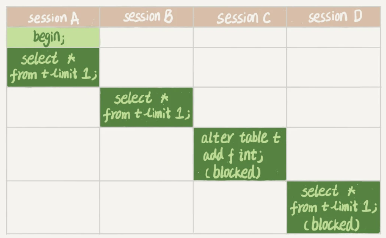

## mysql 锁

### 全局锁

在整个 mysql 实例上加锁,让整个数据库处于 **只读** 状态,一般仅在全局备份的时候才会用到

实际上 mysql 在做全局备份的时候,是通过 `MVCC(多版本并发控制)` 类似于事务的一致性视图一样,在全局备份的时候通过生成一张一致性视图,来保证其他事务的正常更新和读取

### 表级锁

#### 表锁

表锁不仅仅会限制其他线程的读写,还会限制 **申请表锁的线程** 对其他表的读写

例如线程 `t1` 申请了对 `tb1` 表的 `read 读锁`, 对 `tb2` 表的 `write 写锁`,此时线程 `t2` 试图写 `tb1` 表会被阻塞; 不仅如此,线程 `t1` 也只能读取 `tb1` 表和写 `tb2` 表,连写 `tb1` 都不允许自然也不允许访问其他表

表锁对同一张表的限制非常大,会导致其他多个事务因为表锁而阻塞

#### MDL 元数据锁

MDL 元数据锁不需要显式申请,它在访问表的时候被自动加上,用于保证表结构的一致性,防止出现一个事务正在读取数据,另一个事务却修改了表结构的情况发生

* 当一个线程对表做 **增删改查** 的时候,自动加上 MDL 读锁
* 当一个线程对标做 **表结构修改(即 ALTER 语句)` 的时候,自动加上 MDL 写锁

同时 MDL 锁有以特性

* 多个读锁之间不互斥,允许有多个事务同事对一张表进行增删改查
* 读写和写写之间互斥,以保证数据库表结构的一致性
* 在语句执行开始时申请,但是在语句执行结束后并不会立马释放,而是要等待整个事务结束后才释放 MDL 锁

第三点很容易导致 MDL 锁申请阻塞,考虑如下情景

事务 A 申请 MDL 读锁,没问题; 事务 B 也申请 MDL 读锁,没问题

事务 C 申请 MDL 写锁,此时因为前面有两个 MDL 读锁的存在,所以事务 C 会被阻塞

问题来了,此时事务 D 申请 MDL 读锁,会因为事务 C 的写锁申请失败进而也被阻塞

也就是说在事务 C 的写锁申请被阻塞后,后面所有对整张表的读写都会被阻塞,因为 **MDL 写锁导致阻塞产生** 

### 如何安全的给小表加字段

考虑到 `alter` 语句可能导致 MDL 锁阻塞

一个常见的做法就是 `kill` 掉当前活跃的事务,然后执行 `alter` 语句,对于一些冷表可能有效; 但是一张热点表上的查询请求十分频繁,没办法 `kill` 掉所有的请求

另一个做法就是在 `alter` 语句后面添加等待时间,即尝试加 MDL 写锁,如果若干时间内加锁失败,就停止加锁,这样后续的请求只会被阻塞有限的若干时间

## 两阶段锁协议协议

什么是两阶段锁协议? 在 InnoDB 的事务当中, **行锁是在需要的时候才加上,但并不是语句执行完之后就立即释放,而是要等到整个事务结束时才释放**

两阶段锁协议最有用的就是指导我们尽可能降低锁的并发影响,**如果一个事务当中需要锁定多行记录,要把最有可能造成锁冲突,最有可能影响并发度的锁即可能放到事务的后面部分**

考虑如下场景:
1. 顾客 A 从账户余额当中扣除商品单价
2. 给老板的账户余额增加商品单价
3. 记录交易记录

为了保证交易的原子性,自然而然地把前两个 `update` 语句和最后的 `insert` 语句放到一个事务里面执行,由于两个 `update` 语句执行的先后并无直接影响,所以如何安排这两个语句的执行顺序,以保证 **尽可能减小行锁对其他事务的影响**

如果此时有另外一个客户 B 也在购买商品,那么会在语句 `2` 上面产生 `update` 冲突,因为这两个事务要修改同一条记录

假设事务 A 仍然按照 `123` 的顺序执行,那么事务 B 可能在事务里面已经完成了步骤 `1`,只不过阻塞在步骤 `2` 了

假设事务 A 调整执行顺序,按照 `312` 的顺序执行,那么事务 B 就可能已经完成步骤 `31` 阻塞在步骤 `2`

这样看来事务 AB 阻塞的时间就是最短的,提升了整个系统的并发度

### 死锁问题

由于 **两阶段锁协议导致行锁在语句执行时申请,但是要等到事务结束后才释放** 者很有可能导致几个事务都在等待其他事务释放自己需要的锁,从而产生 **死锁** 

事务 A 申请了 `id = 1` 的行锁,事务 B 申请了 `id = 2` 的行锁

接下来事务 A 需要 `id = 2` 发现被其他事务占用,进而等待; 事务 B 需要 `id = 1` 发现也被其他事务占用,进而等待,最终导致两个事务互相等待对方释放自己需要的锁,产生了 **死锁**

mysql 在解决 **死锁** 问题上,提供了两个方案

1. 超时等待: 也就是说当一个事务等待其他事务释放锁的时候,并不会一直等待下去,而是有一个超时时间,当等待超时之后,就会放弃锁的申请

InnoDB 的默认超时等待时间为 50 秒,也就是说一个线程被锁住后要等待 50 秒后才会被释放掉,对于即时服务来说这个等待时间太长无法接受

2. 主动死锁检测: 当一个事务被锁的时候, InnoDB 需要查看这个事务所依赖的资源有没有被其他事务锁住,如此递归循环下去直到最后判断是否产生了 **死锁**

由于每个新事务被阻塞后,都要主动检测是不是由于自己的加入产生了死锁,这会消耗大量系统资源,导致严重的性能问题; 1000 个事务,就要检测 1000*1000 百万次

**关掉主动死锁检测机制** 明显不可靠,为了保证 mysql 的性能,从而导致业务大量产生死锁,这对业务会带来严重损失

或者通过 **控制并发度** 来控制主动死锁检测的性能问题,例如限制一行记录最多只能有 10 个事务同时更新,这样 10*10 一百次的主动死锁检测开销就很低; 但是这个方法也不靠谱,因为一个线上业务往往都不止 10 个线程同时并发请求,这会导致其他线程的阻塞

还有就是将 **单行的修改逻辑分散到多行上来减少锁冲突**, 最简单的例子就是将老板的 **一个** 账户拆分为 **多个** 子账户,这样每个客户付款后随便增加其中一个子账户的余额即可; 这可以有效减少锁冲突发生的概率