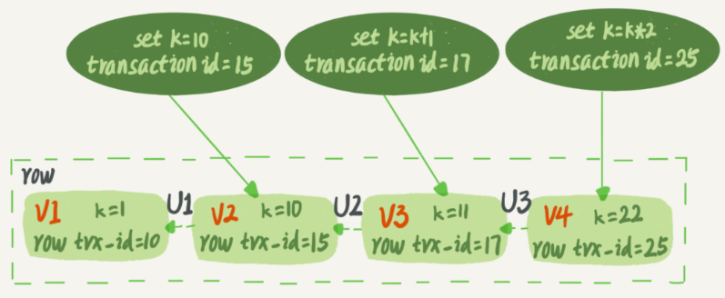
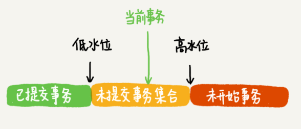
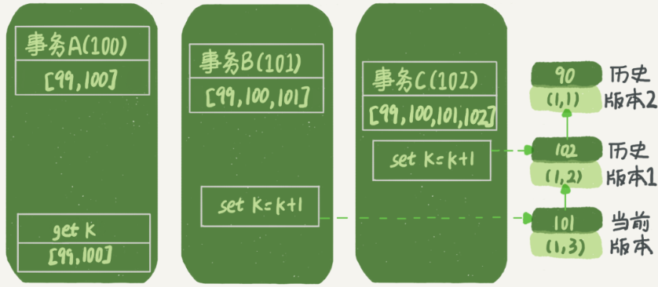
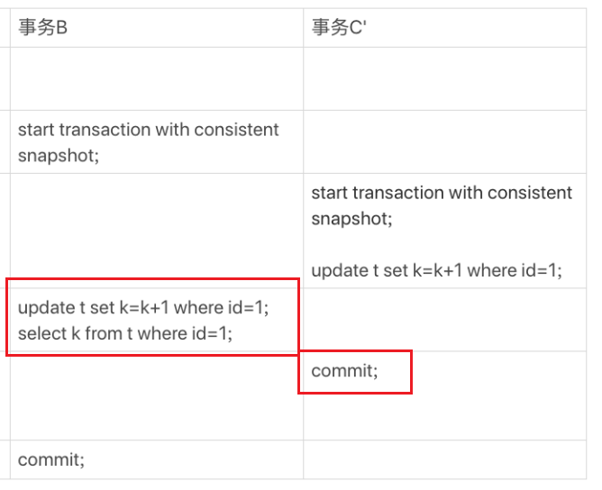

## 加锁后事务的隔离性

在可重复读隔离级别下,事务启动时会创建一个 **视图**, 用于保证事务读取数据的一致性,**即使有其他事务在此期间修改了数据,当前事务观测到的数据仍然跟启动时保持一致**

对于行锁来说,一个事务要更新一行记录,如果这行记录的行锁被其他事务所占有,那么当前事务就会被阻塞. 当这个事务获取到记录上的行锁后, **视图** 究竟是如何保证数据的一致性的

### 快照

在可重复读级别下,**视图** 的创建就好像是在事务启动时 **拍了张快照**,这个 **快照** 是如何实现的

InnoDB 里面每个事务都有一个 **全局唯一的事务 ID**,一般简称为 `tid`,这个 `id` 是按照事务创建顺序严格递增的

`MVCC` 字如其名 **多版本并发控制** 也就是说一个数据会存在 **多个版本**, 每次事务在更新数据后,这行数据都会产生一个新的数据版本,并且把对应的事务 `tid` 赋给这个最新的数据版本

也就说每行数据都存在多个版本,每个版本都记录了产生数据对应的事务 `tid`,如下

结合前面的日志系统,可以看到每行数据发生修改时产生的 `undolog` 其实就是在这里记录的

实际上 InnoDB 并不会保存每个 `V1,V2,V3` 而是在需要的时候通过回滚段 `undolog` 计算出来,例如需要 `V2` 的时候,就通过最新版本 `V4` 加上 `U3,U2` 计算得到 `V2`

按照 **可重复读隔离级别** 的定义,一个事务启动时,就能看到所有 **已经提交** 的事务的修改结果,但是在这个事务执行期间,其他事务的修改结果对其不可见

因此 InnoDB 为每个事务维护了一个数组,这个数组里面保存了 **当前事务启动的瞬间其他正在活跃的事务 ID**,其中 **活跃** 指的是已经启动了但是还没有提交的事务

这个数组的最小 `ID` 记作 **低水位**; 最大 `ID` 值 `+1` 记作 **高水位**

这个事务 `ID` 数组,就构成了当前事务的 **一致性视图(也可以叫做一致性快照)**,这个数组被 **低水位** 和 **高水位** 分为了三个部分

数据的一个版本 `tid` 有 3 中可能:

1. 绿色部分,小于 **低水位**, 表示这个版本的数据是由已提交的事务生成的,对于当前事务是 **可见的**
2. 红色部分,大于等于 **高水位**,表示这个版本的数据是由未来启动的事务生成的,对于当前事务肯定是 **不可见的**
3. 黄色部分,大于等于 **低水位**,小于 **高水位**,又分为两种情况

    a. 若 `tid` 在数组当中,表示这个版本的数据是由还没提交的事务产生,对当前事务是 **不可见的**
    b. 若 `tid` 不在数组当中,表示这个版本的数据是由已经提交的事务产生,对当前事务是 **可见的**

举个例子说明,假设数据库存在如下操作

在事务 A 开始前,数据库只有一个活跃的事务 `tid = 99`,事务 ABC 的 `tid` 分为为 `100,101,102`

对于事务 A 来说,它查询到的数据版本为 `101(1,3)` 是来自于事务 B 的修改,读取流程如下

* 当前数据版本为 `101(1,3)`,然而 `tid = 101` 比高水位还要大,所以对事务 A 来说 `101` 版本的数据不可见
* 上一个数据版本为 `102(1,2)`,同理 `tid = 102` 比高水位还要大,所以事务 A 仍然不可见
* 再上一个版本数据为 `90(1,1)`,`tid = 90` 比低水位还要小,所以事务 A 可见

最终事务 A 查询到的数据为 `90`,即使这个事务过程中已经有事务 BC 修改了数据,在一致性视图的保证下,事务 A 仍然只能访问到创建视图时的数据 `90`

也可以按照数据版本是否提交来分析

* 数据 `(1,3)` 是还没有提交的事务 B 修改的,自然 **不可见**
* 数据 `(1,2)` 是已经提交的事务 C 修改的,但是事务 C 属于在视图创建后提交的,仍然 **不可见**
* 数据 `(1,1)` 是在视图创建之前提交的,所以 **可见**

### 一致性读和当前读

按照这样的分析,事务 B 在修改数据时,由于事务 C 的提交是在事务 B 的一致性视图创建之后才完成的,所以事务 B 能够访问到的数据应该是 `(1,1)` 才对. 可为什么事务 B 在修改数据后,变成了 `(1,3)` 而不是 `(1,2)` 呢

这里 InnoDB 有一条规则: **更新数据时都是先读后写,而这个读必须读取当前值**,这条规则被称为 **当前读**

如果按照一致性读处理,这里事务 B 修改数据后变为 `(1,2)`, 那么事务 C 的修改就丢失了!

因此当一个事务要去更新数据的时候, **不能在历史版本上更新,否则可能会导致其他事务的提交丢失**,所以事务 B 在修改数据的时候,是在事务 C 最新的数据之上修改的

当事务 B 再次查询数据时,一看数据的 `tid = 101` 正式自己的 `tid` ,来自于自己的更新当然是可见的; 也可以说 **自己的修改自己当然要认**

考虑下如果事务 C 不再是一条简单的 `update` 语句,而是一个完整的事务,并且在事务 B 修改之前才提交

对于事务 B 来说,当他在更新数据时,此时的数据版本已经来到了 `102(1,2)`,由于 **两阶段锁协议** 的存在,数据上面的写锁并不会在事务 C 完成更新后立即释放,而是要等到事务 C 提交后才会释放

此时事务 B 对数据的更新将会被锁住,直到事务 C 释放数据上的写锁后事务 B 才能更新