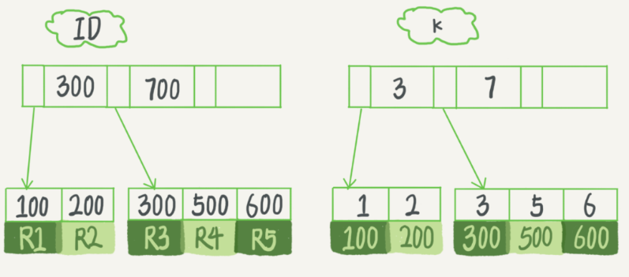

## 唯一索引和普通索引

以下图中的索引为例,假设字段 `k` 上的值都不重复



### 查询过程

如果执行以下查询语句

```sql
select id from table where k = 5
```

按照之前的分析,这条语句先在字段 `k` 的索引树上查找定位到 `k = 5` 的记录,然后返回记录中的 `id = 500`

* 如果是普通索引,那么在找到第一个满足 `k = 5` 的记录后,会在 B+ 树的双向链表上往后遍历查找,直到第一个不满足 `k = 5` 的数据出现,然后返回这些符合条件的数据 `id` 值
* 如果是唯一索引,由于索引的唯一性,在找到第一个 `k = 5` 的记录后,就直接返回不再继续往后查找

可以看到在某些场景下唯一做引的检索次数会比普通索引要更少,但其实这里的性能差距几乎可以忽略不计

因为 **磁盘预读** 优化导致实际上加载数据页到内存当中,是以 **页** 为单位的这很大程度上会把 `k = 5` 后面若干数据放到一 **页** 当中加载到内存

所以对于后续 `k = 5` 的遍历不过是在内存里面改改指针的值,速度也是非常快的,所以大部分场景下这两种索引的 **查询性能** 几乎不会有太大差距

### 更新过程

这里引入一个新的组件 `change buffer`

当需要更新一个数据页的时候,如果这个数据页就在内存当中,可以直接更新内存

然而如果不在内存当中,就需要从磁盘里面加载对应的页到内存里再更新, InnoDB 为了减少加载磁盘页的操作次数,会先将这些更新操作缓存到 `change buffer` 里面,这样就不用从磁盘里面读取了

在下次需要 **读取** 这个数据页的时候,再从磁盘里面加载数据页到内存,并应用 `change buffer` 里面的修改,这样就能保证数据的一致性. 将 `change buffer` 里面的操作应用到内存数据页这个过程叫做 `merge`, InnoDB 会有后台线程定期执行 `merge` 保证数据库的持久性和一致性

#### 什么场景下才能使用上 change buffer 呢

对于唯一索引来说,所有的更新操作都需要判断这个操作是否违反唯一性约束

比如插入 `k = 4` 这条记录来说,就需要先判断表里面是否已经存在 `k = 4` 的记录,这个时候就 **必须** 从数据页里面读取,如果内存里面没有对应的数据页,就 **必须** 从磁盘里面加载对应的数据页到内存里面; 如果内存里面已经有了数据页,那么直接操作内存即可,也不在需要操作 `change buffer` 了

由此可见,由于需要校验唯一性约束,对于唯一索引来说,就没法使用 `change buffer`; 只有普通索引才能使用 `change buffer`

1. 记录对应的目标页已经存在于内存当中

    a. 唯一索引,找到 `3` 和 `5` 之间的位置,判断是否存在冲突后插入
    b. 普通索引,找到 `3` 和 `5` 之间的位置,直接插入

对于这两种索引的插入操作,只有一个判断是否存在冲突的,对于性能的影响非常小

2. 记录对应的目标页不在内存当中

    a. 唯一索引,必须要从磁盘里面加载目标页到内存里面,找到合适位置后判断是否存在冲突再插入
    b. 普通索引,将更新操作写入 `change buffer`

可以看到,对于目标页不在内存里的情况,唯一索引必须要进行一次 `I/O` 操作以保证一致性,而普通索引只需要在 `change buffer` 里面记录就可以结束. 在这种场景下,唯一索引的性能就要低于普通索引

#### 普通索引用上了 change buffer 一定会更快吗

考虑两种场景,大前提是目标页都 **不在** 内存当中

1. 数据写入后不会立即访问

由于没有立即查询请求,此时写入 `change buffer` 后并不会立即触发 `merge` 操作; InnoDB 可以让 `change buffer` 积累到一定程度后再一次性写入到磁盘当中,这个时候 `change buffer` 的使用效果最好

2. 数据写入后立即访问

由于目标页并不存在内存当中,即使在写入 `change buffer` 之后,因为查询请求的立即到来,会立即从磁盘里面读取目标页放到内存当中进行 `merge` 操作

如果这样的 **缺页** 发生的很频繁,那么会导致频繁的磁盘 `I/O` 操作,反而会降低整个数据库的性能
