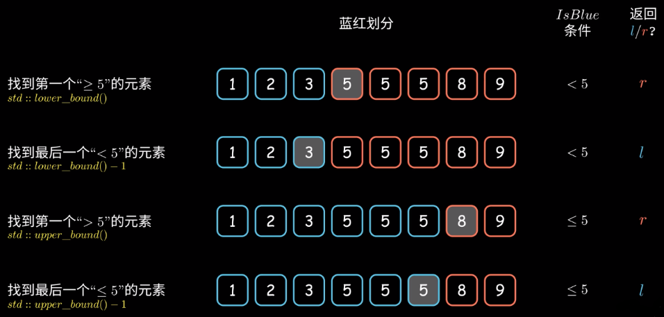

# 蓝红二分法模板

### 主要思路

1. 开始时 l 和 r 都处于查找数据界外，蓝色 l = -1 ，红色 r = n ，此时所有元素均未着色
2. 循环条件是 l+1 != r，当红蓝色接壤时，即 l+1 == r 此时查找停止，此时所有元素均完成着色
3. mid 的查找条件仍然是 mid = (l+r)/2  ==> mid = l+(r-l)/2
4. 每次查找结束后，l 和 r 直接变为 mid，并对 [l,mid] 或者 [mid,r] 的区间进行对应的着色，此时不再需要 l+1 或者 r-1 操作

### 解决二分查找的变种问题

其中对于 `mid` 的判断条件，不再是判断 `mid == targe`，而是判断 `mid` 是否是蓝色还是红色

伪代码如下：
```
    l = -1, r = n
    while (l+1 != r) {
        mid = l+(r-l)/2
        if (IsBlue(mid)) {
            l = mid
        } else {
            // mid is RED
            r = mid
        }
    }
    return l or r
```

### 循环条件的确定

结束循环的条件是，红蓝区域接壤，即 `l+1 == r`，那么循环的条件可以写作 `l+1 < r` 或者 `l+1 != r`

在极端情况下，即查找区间只有一个元素的时候，`l == -1, r == 1`，此时条件 `l+1 != r` 不成立，导致唯一一个元素没有染色

一般来说，直接用 `l+1 < r` 即可

### 特殊情况

如果结束搜索后，`l == -1` 即整个区间被染色为红色，目标元素位于蓝色区间；或者 `r == n` 即整个区间被染色为蓝色，目标元素位于红色区间

这两种情况都需要额外的后置处理

### 建模过程-确定 IsBlue() 函数

二分查找主要的判断条件有 5 种分别是：`<, <=, >, >=, =`，对于这 5 种判断条件函数 `IsBlue()` 的处理方式也不同

1. 最简单的就是 = 且不存在重复元素，即 mid == targe，返回 mid 的下标即可，不用考虑染色问题

```
t < 5
1, 2, 3, 5, 5, 5, 8, 9
------l  r------------
```
2. 找到最后一个小于 t 的元素，即 `mid < t`，返回 `l`

```
t <= 5
1, 2, 3, 5, 5, 5, 8, 9
---------------l  r---
```
3. 找到最后一个小于等于 t 的元素，即 `mid <= t`，返回 `l`

```
t > 5
1, 2, 3, 5, 5, 5, 8, 9
---------------l  r---
```
4. 找到第一个大于 t 的元素，即 `mid > t`，返回 `r`

```
t >= 5
1, 2, 3, 5, 5, 5, 8, 9
------l  r------------
```
4. 找到第一个大于等于 t 的元素，即 `mid >= t`，返回 `r`

总结：

**< 和 <= (最后一个)在左边的蓝色区域查找，且返回的下标也是蓝色区域的下标 `l`**

**> 和 >= (第一个)在右边的红色区域查找，且返回的下标也是红色区域的下标 `r`**

**怎么划分最后一个和第一个元素? 按照一般的认知标准，都是顺序从前往后查找，对于 < 从前往后查找自然是找到最后一个元素；对于 > 从前往后找自然是找到第一个元素**

**目标元素 `t` 分配给能够包含 `=` 条件的区间**

例如：

1. 对于 <，左边蓝色区域不包含 =，右边红色区域 >= 包含 =，将目标元素 `t` 分配给右边红色区域 **最左侧** 元素
2. 对于 <=，左边蓝色区域包含 =，右边红色区域 > 不包含 =，将目标元素 `t` 分配给左边蓝色区域 **最右侧** 元素
3. 对于 >，左边蓝色区域 <= 包含 =，右边红色区域 > 不包含 =，将目标元素 `t` 分配给左边蓝色区域 **最右侧** 元素
4. 对于 >=，左边蓝色区域 < 不包含 =，右边红色区域 >= 包含 =，将目标元素 `t` 分配给右边蓝色区域 **最左侧** 元素

